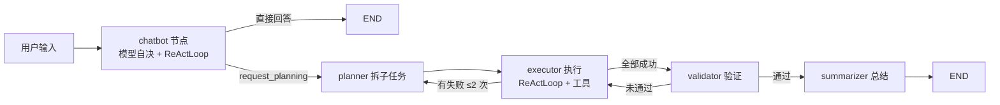

# 🤖 Agnes Agent

> 一个亲手搭建的 LangGraph 智能体：模型自决工具调用、5 层记忆、多 Key 自动轮换、沉浸式 Web 调试面板。
> 目标不是"调 API 出结果"，而是把 Agent 的"思考—行动—观察"循环一层层拆开，看明白再动手。

  

🛠️ **学习实验项目** —— 以理解 ReAct / LangGraph 机制为主要目的，欢迎提 Issue 交流，勿期待生产级稳定性。

---

## 📑 目录

- [效果演示](#-效果演示)
- [项目背景](#-项目背景)
- [核心特性](#-核心特性)
- [快速上手](#-快速上手)
- [设计思路与实现过程](#-设计思路与实现过程)
- [项目文件结构](#-项目文件结构)
- [Roadmap 与致谢](#-roadmap-与致谢)

---

## 🎬 效果演示

启动后，终端会打出模型自决决策的日志；对话过程中每一次工具调用都会在 Web 面板上实时展示（工具名 + 参数 + 结果）。

```text
LLM 类型: <class 'app.llm.llm_factory.RotatingKeyChatOpenAI'> | provider=openai_compatible model=agnes-2.5-flash
🔍 控制面板: http://localhost:8000
🤖 Agent 已启动，输入 'quit' 或 'exit' 退出。

你 > 我最近的任务有哪些？
[Chatbot] 自决模式（无 L1/L2/L3 硬切）
[ReAct] 第 1/15 轮
✅ [Chatbot] 回答长度: 210
🤖 你最近的完成任务有：1. 开发网页版贪吃蛇游戏 ……（Web 面板同步展示工具卡片与状态行）
```

Web 面板（http://localhost:8000）：

- 左侧**历史会话**列表显示每条会话的最后一条用户消息，支持**批量删除**
- 发送框上方**状态行**实时显示正在执行的工具（`list_my_recent_tasks({...})`）
- 需要人工确认的工具（命令执行 / 文件写改删）弹出**审批卡片**，可每次询问 / 本次会话允许 / 永久允许
- 右上角**交付物 / 设置**入口：交付物页展示 Agent 生成的产出文件；设置页内含 State、提示词、追踪、记忆、Memory DB、定时任务、模型管理等调试能力

---

## 🧭 项目背景

**为什么做这个？** 自学 LLM 应用时发现"光调 API 太无聊"——想亲手实现一遍 Agent 的调度逻辑：模型怎么决定调哪个工具？工具结果怎么回到上下文？多轮循环怎么终止？记忆怎么跨会话留存？

**解决了什么问题？** 一个可本地运行的完整 Agent 骨架：对话 → 规划 → 执行 → 验证 → 总结，全程可观察、可审查、可切换模型。

**标签**：🛠️ 学习实验项目 · 📚 概念验证。请不要把它当成生产框架来用。

---

## ✨ 核心特性

- ✅ **模型自决路由**：无硬编码意图分类，LLM 自行决定"直接回答 / 调工具 / 进入多步规划"
- ✅ **自定义 ReAct 循环**：亲手实现思考—行动—观察闭环（`ReActLoop`），支持工具安全拦截、人工审批、连续拒绝熔断、迭代上限防死循环
- ✅ **5 层记忆系统**：会话摘要 / 用户画像 / 历史任务 / 命令历史 / 语义缓存，每轮自动注入 System Prompt
- ✅ **多 Key 自动轮换**：api_key 逗号分隔，限流/超时/鉴权自动换 key + 指数退避重试
- ✅ **沉浸式 Web 面板**：流式对话、工具状态行、审批卡片、State/日志/记忆/定时任务调试抽屉、模型一键切换
- ✅ **标准 cron 定时任务**：`*/5 * * * *` 常规 cron 语法驱动 Agent 周期性执行任务

---

## 🚀 快速上手

### 环境准备

- **Python 3.12+**
- 一个 **OpenAI 兼容网关**的 `base_url` + `api_key`（模型凭据在 Web 面板设置页接入，不写死在代码里）
- 可选：Tavily API Key（联网搜索）

### 安装

```bash
git clone <repo-url> && cd Agnes-Agent
python -m venv .venv

# Windows
.venv\Scripts\activate
# macOS / Linux
source .venv/bin/activate

pip install -r <(uv export --format requirements)   # 或按 pyproject.toml 安装依赖
```

### 最小运行

```bash
python -m app.main
```

预期输出：

```text
LLM 类型: <class 'app.llm.llm_factory.RotatingKeyChatOpenAI'> | provider=openai_compatible model=agnes-2.5-flash
🔍 控制面板: http://localhost:8000
🤖 Agent 已启动，输入 'quit' 或 'exit' 退出。
```

打开 http://localhost:8000 即可对话；首次使用先到右上角 **设置 → 模型** 页接入你的模型（填 Base URL + API Key，可自动拉取模型列表）。

> `.env` 只放非模型密钥（如 `TAVILY_API_KEY`）；模型凭据统一在 `data/.model_config` 由设置页管理。

---

## 🧠 设计思路与实现过程

### 架构总览



### 关键模块拆解

| 模块 | 职责 | 设计要点 |
|---|---|---|
| `graph/builder.py` | 节点编排 + 条件路由 | 路由决策全部读 DB（任务进度唯一真相源），state 只传标识 |
| `planning/react_loop.py` | 思考—行动—观察循环 | 自实现：安全拦截、审批 interrupt、连续 3 次同调用熔断、`max_iterations` 防死循环 |
| `memory/memory_manager.py` | 5 层记忆 | L2/L3/L4 每轮注入 System Prompt，L5 语义缓存带 TTL |
| `llm/llm_factory.py` | 多 Key 轮换 | 401/429/5xx 换 key，指数退避（2^n+jitter，上限 30s） |
| `server/api/chat.py` | SSE 流式推送 | `updates` + `messages` 双通道；工具事件监听桥 |

### 技术选型理由

- **为什么用 LangGraph？** 需要 checkpoint 中断/恢复来支撑"审批挂起"和"多轮会话续聊"，手写状态机成本太高。
- **为什么工具执行不用 LangGraph 的 ToolNode，而是自写 ReActLoop？** 想亲手实现工具调度的完整细节：安全拦截、审批、拒绝熔断、`request_planning` 之类的"元工具"返回值透传——这些在 ToolNode 里会被框架隐藏。
- **为什么 SSE 用双通道（updates + messages）？** 流式 token（messages）负责打字机效果，节点状态（updates）负责最终文本兜底与审批事件。

### 踩坑与解决实录（真实经历）

1. **坑：模型工具调用增量以 dict 形态投递，`getattr` 读出来恒为空。**
   → 发送框上方的"工具调用状态行"一度永远空白。定位后发现网关把 `tool_call_chunks` 以 `dict` 投递（首个 chunk 带 name，后续是 JSON 片段），`getattr(tc, "name")` 对 dict 恒返回 `None`。解决：兼容 dict/对象两种形态解析，并按 `index` 累积参数片段。

2. **坑：审批模式"每次询问"形同虚设——切了 per_ask 却不弹审批卡。**
   → 后端 `_CONFIG` 里 `approval_mode` 会被"新建会话"整体重置回 `session_allow`，而前端按钮仍高亮 per_ask。解决：`/new`、`/resume` 只切换 `thread_id`、保留审批模式；前端切换会话后重新向后端读取实际模式同步按钮。

3. **坑：messages 流对同一次 LLM 调用先推流式 chunk、再推完整消息，回复被显示两遍。**
   → 只处理 `AIMessageChunk`，完整文本由 `updates` 模式的 final 事件兜底。

4. **坑：调试面板 State 里的 messages 永远是空的。**
   → `update_state` 只 import 从未调用，快照表恒空。解决：流结束后用 `graph.get_state()` 取完整 state 落快照。

---

## 📂 项目文件结构

```
Agnes-Agent/
├── app/
│   ├── main.py                    # 入口（python -m app.main）
│   ├── config.py                  # 配置中心（路径统一指向 data/）
│   ├── graph/                     # LangGraph 工作流（节点 + 路由 + 状态）
│   ├── llm/                       # LLM 纯工厂（多 key 轮换，零配置）
│   ├── memory/                    # 5 层记忆管理器（SQLite）
│   ├── planning/                  # planner / executor / validator / summarizer + ReActLoop
│   ├── tools/                     # 工具集（搜索/命令/文件/记忆/规划触发…）
│   └── server/                    # FastAPI + SSE 流式 + 调试面板前端
│       ├── store.py               # 公共删除逻辑 / 日志 / 事件流 / State 快照
│       ├── config.py              # 模型目录管理（自定义来源，无内置厂商）
│       └── static/                # 前端（index.html + app.js + style.css）
├── data/                          # 运行时数据（memory.db / checkpoints.db / traces/）
├── deliverables/                  # Agent 生成的交付物（如 snake_game/）
├── tests/                         # pytest 回归测试
├── pyproject.toml                 # 项目元数据 + 依赖
├── uv.lock                        # 锁定依赖
└── README.md
```

---

## 🗺 Roadmap 与致谢

**Roadmap**

- [ ] 接入更多工具（浏览器操作、数据库查询、图片生成）
- [ ] 多模态输入（图片/语音进对话）
- [ ] 记忆层增强：语义检索从"关键词缓存"升级为向量检索
- [ ] 流式中间态可视化（思考过程实时展示）

**致谢**

- ReAct 论文（*Synergizing Reasoning and Acting in Language Models*）
- LangChain / LangGraph 社区
- 所有在调试面板上被反复试错的模型网关

**许可证**：MIT

**交流**：欢迎在仓库 Issue 区留言，或邮件联系（你的邮箱 / GitHub）。
