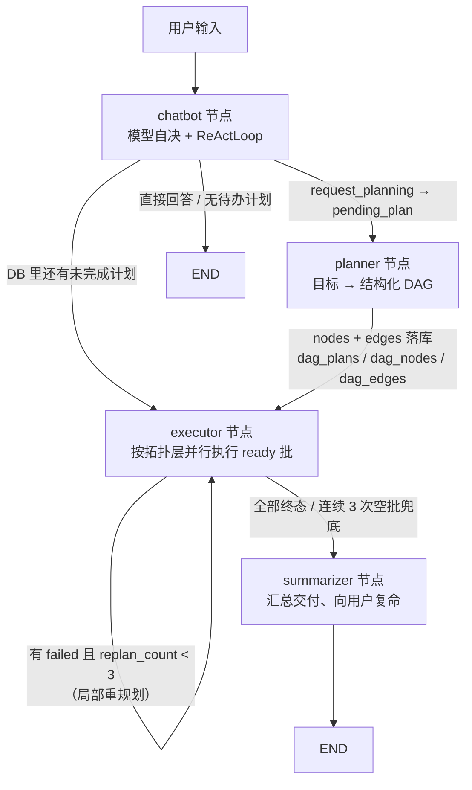

# 🤖 Agnes Agent

> 一个亲手搭建的 LangGraph 智能体：模型自决工具调用、5 层记忆、多 Key 自动轮换、沉浸式 Web 调试面板。
> 目标不是"调 API 出结果"，而是把 Agent 的"思考—行动—观察"循环一层层拆开，看明白再动手。

  

🛠️ **学习实验项目** —— 以理解 ReAct / LangGraph 机制为主要目的，欢迎提 Issue 交流，勿期待生产级稳定性。

---

## 📑 目录

- [效果演示](#-效果演示)
- [项目背景](#-项目背景)
- [核心特性](#-核心特性)
- [快速上手](#-快速上手)
- [设计思路与实现过程](#-设计思路与实现过程)
  - [DAG 模式（Plan-and-Execute）设计理念](#-dag-模式plan-and-execute设计理念)
- [项目文件结构](#-项目文件结构)
- [Roadmap 与致谢](#-roadmap-与致谢)

---

## 🎬 效果演示

启动后，终端会打出模型自决决策的日志；对话过程中每一次工具调用都会在 Web 面板上实时展示（工具名 + 参数 + 结果）。

```text
LLM 类型: <class 'app.llm.llm_factory.RotatingKeyChatOpenAI'> | provider=openai_compatible model=agnes-2.5-flash
🔍 控制面板: http://localhost:8081
[10:17:03] OK    控制台日志已启动（后台服务模式，对话请到调试面板）
[10:17:03] ▶ 节点开始 chatbot
🤖 你最近的完成任务有：1. 开发网页版贪吃蛇游戏 ……（Web 面板同步展示工具卡片与状态行）
```

Web 面板（默认 http://localhost:8081，被占自动顺延）：

- 左侧**历史会话**列表显示每条会话的最后一条用户消息，支持**批量删除**
- 发送框上方**状态行**实时显示正在执行的工具（`list_my_recent_tasks({...})`）
- 需要人工确认的工具（命令执行 / 文件写改删）弹出**审批卡片**，可每次询问 / 本次会话允许 / 永久允许
- 右上角**交付物 / 设置**入口：交付物页展示 Agent 生成的产出文件；设置页内含 State、提示词、追踪、记忆、Memory DB、定时任务、模型管理等调试能力

---

## 🧭 项目背景

**为什么做这个？** 自学 LLM 应用时发现"光调 API 太无聊"——想亲手实现一遍 Agent 的调度逻辑：模型怎么决定调哪个工具？工具结果怎么回到上下文？多轮循环怎么终止？记忆怎么跨会话留存？

**解决了什么问题？** 一个可本地运行的完整 Agent 骨架：对话 → 规划（DAG）→ 按拓扑层并行执行 → 验收契约校验 → 交付汇总，全程可观察、可审查、可切换模型。

**标签**：🛠️ 学习实验项目 · 📚 概念验证。请不要把它当成生产框架来用。

---

## ✨ 核心特性

- ✅ **模型自决路由**：无硬编码意图分类，LLM 自行决定"直接回答 / 调工具 / 进入多步规划"
- ✅ **DAG 模式多步规划**：planner 把目标拆成 `nodes + edges`，executor 按拓扑层并行执行；支持软依赖、失败隔离、局部重规划（上限 3 次）与验收契约硬校验 —— 详见 [DAG 模式设计理念](#-dag-模式plan-and-execute设计理念)
- ✅ **自定义 ReAct 循环**：亲手实现思考—行动—观察闭环（`ReActLoop`），支持工具安全拦截、人工审批、连续拒绝熔断、迭代上限防死循环
- ✅ **分层记忆系统**：L1 对话消息（含工具调用事件） / L2 用户画像 / L3 任务历史（dag_plans） / L6 知识图谱 GraphRAG（实体关系图谱 + 混合检索，详见 [docs/l6-graphrag.md](docs/l6-graphrag.md)；原 L4 命令历史与 L5 语义缓存已并入 L1 事件与 L6 图谱）
- ✅ **多 Key 自动轮换**：api_key 逗号分隔，限流/超时/鉴权自动换 key + 指数退避重试
- ✅ **沉浸式 Web 面板**：流式对话、工具状态行、审批卡片、State/日志/记忆/定时任务调试抽屉、模型一键切换
- ✅ **标准 cron 定时任务**：`*/5 * * * *` 常规 cron 语法驱动 Agent 周期性执行任务

---

## 🚀 快速上手

### 环境准备

- **Python 3.12+**
- 一个 **OpenAI 兼容网关**的 `base_url` + `api_key`（模型凭据在 Web 面板设置页接入，不写死在代码里）
- 可选：Tavily API Key（联网搜索）

### 安装

```bash
git clone <repo-url> && cd Agnes-Agent
python -m venv .venv

# Windows
.venv\Scripts\activate
# macOS / Linux
source .venv/bin/activate

pip install -r <(uv export --format requirements)   # 或按 pyproject.toml 安装依赖
```

### 最小运行

```bash
python -m app.main
```

启动预期输出（片段）：

```text
LLM 类型: <class 'app.llm.llm_factory.RotatingKeyChatOpenAI'> | provider=openai_compatible model=agnes-2.5-flash
🔍 控制面板: http://localhost:8081
[10:17:03] OK    控制台日志已启动（后台服务模式，对话请到调试面板）
```

> `python -m app.main` 现在是纯后台服务模式（无终端对话循环），与 `python -m app.service` 基本等价，但端口被占时会自动顺延到 8082+。遗留参数 `--new` 可开启新会话。

打开 http://localhost:8000 即可使用。**首次打开调试面板时会引导你设置账号密码**——凭据以 PBKDF2-SHA256（12 万轮 + 随机 salt）存入 `data/auth.json`（已 `.gitignore`，不含明文密码）；想重置就删掉该文件再刷新页面。若设置了 `.env` 的 `AGENT_USERNAME` / `AGENT_PASSWORD`（两个都填才生效），则优先使用它，适合无人值守部署。首次使用先到右上角 **设置 → 模型** 页接入你的模型（填 Base URL + API Key，可自动拉取模型列表）。

> `.env` 只放非模型密钥（如 `TAVILY_API_KEY`）；模型凭据统一在 `data/.model_config` 由设置页管理。

### 服务模式（HTTP 常驻 + 后台服务）

Agent 以常驻服务方式运行，**没有终端对话循环**——对话、审批、定时任务全部走 Web 调试面板：

```bash
python -m app.main                          # 后台服务（调试面板默认 8081，被占自动顺延）
python -m app.service                       # 同服务模式，默认 0.0.0.0:8081，开启热重载
python -m app.service --port 9000           # 改端口
python -m app.service --no-reload           # 关闭热重载
python -m app.service --new                 # 开新会话（新的 thread_id）
```

预期输出（片段）：

```text
🔍 控制面板: http://localhost:8081
[thread_id] a1b2c3d4-...
[10:17:03] OK    控制台日志已启动（后台服务模式，对话请到调试面板）
[10:17:03] ▶ 节点开始 chatbot
[10:17:03] LLM    planning  1.2s
[10:17:03] TOOL   [chatbot] tavily_search {'query': '...'}
[10:17:03] EXEC   node_1 → success
[10:17:03] OK    任务交付汇总完成 · 2 个产物
```

- **纯 HTTP 驱动**：没有终端输入循环，对话/审批/定时任务全部走 Web 面板（`/api/chat`、`/api/scheduler` 等）；
- **控制台日志**：节点/模型调用/工具/规划/任务等事件以彩色一行实时打印，方便在终端观察 Agent 工作过程；
- **端口固定**：`app.service` 被占用直接报错，不再自动顺延（`app.main` 仍自动顺延）；
- **热重载**：修改 `app/` 目录下的 `.py` 文件，或改 `data/.model_config`（模型配置）后自动重建 graph 并重启，无需手动重启进程（等价命令 `uvicorn app.service:app --reload --reload-dirs app data --reload-includes .model_config`）。只监控 `app/` 与 `.model_config`，`data/*.db`、`traces/` 等运行期写入不会误触发重启；
- 服务模式与 `app.main` 共用 `.thread_id` 文件与 SQLite 存储，会话、记忆天然连续。

### 技能系统（Skills）

Agent 的复合能力包：技能 = `app/skills/<name>/SKILL.md`（YAML frontmatter 元数据 + 步骤正文）。
每轮对话自动把本地技能清单注入 system prompt，命中时模型调 `read_skill` 读全文后**严格按其步骤执行**；
本地不够用时 `search_skillhub` 到 SkillHub 在线市场搜索，你确认后 `install_skill` 下载即装（立即可用）。
调试面板 **设置 → 技能** 页可浏览全部技能与内容。新增技能：在 `app/skills/` 建 `<name>/SKILL.md` 即可，无需重启。

### 部署为开机自启服务（Linux systemd）

```bash
sudo useradd --system --home /opt/agnes-agent agnes   # 首次：创建运行用户
sudo chown -R agnes:agnes /opt/agnes-agent
sudo cp deploy/agnes-agent.service /etc/systemd/system/
sudo systemctl daemon-reload
sudo systemctl enable --now agnes-agent               # 开机自启 + 立即启动
journalctl -u agnes-agent -f                          # 看日志
```

> 服务默认**保留热重载**（改 `app/` 代码或 `data/.model_config` 自动重建）；生产环境想关闭可给启动命令追加 `--no-reload`。脚本/单元文件里的端口、路径按需修改。

---

## 🧠 设计思路与实现过程

### 架构总览（DAG 模式）



> 所有路由决策**读 DB 而非 state**：`dag_plans` / `dag_nodes` 是任务进度的唯一真相源，
> LangGraph 的 state 只传标识与消息。这样"进程重启后接着跑"和"多轮会话续聊"无需额外机制。

### 关键模块拆解

| 模块 | 职责 | 设计要点 |
|---|---|---|
| `graph/builder.py` | 节点编排 + 条件路由 | 路由决策全部读 DB（任务进度唯一真相源），state 只传标识 |
| `planning/react_loop.py` | 思考—行动—观察循环 | 自实现：安全拦截、审批 interrupt、连续 3 次同调用熔断、`max_iterations` 防死循环 |
| `planning/dag_core.py` | DAG 计算内核（纯函数，可单测） | 规范化（丢弃悬空边 / 去重边）、DFS 三色环检测、Kahn 拓扑分层、ready 批计算、失败传播、验收契约解析 |
| `planning/dag_planner.py` | 用户目标 → 结构化 DAG | 模型输出 `nodes`/`edges` → 规范化 → 环检测（成环先请求重规划一次，再成环退化为单节点计划）→ 落库 |
| `planning/dag_executor.py` | 按拓扑层并行执行 DAG | 线程池 + 信号量并行同层节点；单节点复用 `ReActLoop`；`complete_node`/`fail_node` 终止工具 + 验收契约硬校验 |
| `planning/dag_storage.py` | DAG 持久化层（SQLite） | 三表 `dag_plans`/`dag_nodes`/`dag_edges` + 轻量 checkpoint；启动时回收 running 悬空节点；文本字段入库前统一归一 |
| `planning/dag_summarizer.py` | 任务交付汇总 | 汇总各节点结果与**真实落盘**的产物；存在 failed 节点时不调 LLM，直接结构化说明，避免"把失败讲成成功" |
| `memory/memory_manager.py` | 分层记忆 | L2 自动注入 / L1 消息+工具调用事件 / L3 任务历史 / history_summary 压缩历史 |
| `memory/memory_engine.py` | 记忆固化 + 语义检索 | `consolidate`（LLM 提炼事实/偏好）+ `search_semantic`（仅 `fact`/`task`，不含对话原文） |
| `memory/graph_rag_tool.py` | L6 图谱工具 + 被动注入 | `record_graph` / `lightgraph_query` 工具 + 每轮 L6 检索注入（失败静默降级） |
| `memory/ligraphrag_adapter.py` | LightRAG 桥接层 | 专属 worker 事件循环跑 `ainsert/aquery`；Embedding(vstack) / Rerank / 主模型 LLM 三件套包装；按 thread 分桶持久化 |

> **记忆 vs 图谱的边界**：对话原文只进 LightRAG（L6）建图，由 `lightgraph_query` 检索实体关系；
> `search_my_memory` 只查提炼后的长期记忆（`memory_facts` 固化事实/偏好 + `dag_plans` 任务历史），
> 两者数据源不重叠，避免"检索同一份对话原文"的双重命中。
| `llm/llm_factory.py` | 多 Key 轮换 | 401/429/5xx 换 key，指数退避（2^n+jitter，上限 30s） |
| `server/api/chat.py` | SSE 流式推送 | `updates` + `messages` 双通道；工具事件监听桥 |

### 技术选型理由

- **为什么用 LangGraph？** 需要 checkpoint 中断/恢复来支撑"审批挂起"和"多轮会话续聊"，手写状态机成本太高。
- **为什么工具执行不用 LangGraph 的 ToolNode，而是自写 ReActLoop？** 想亲手实现工具调度的完整细节：安全拦截、审批、拒绝熔断、`request_planning` 之类的"元工具"返回值透传——这些在 ToolNode 里会被框架隐藏。
- **为什么 SSE 用双通道（updates + messages）？** 流式 token（messages）负责打字机效果，节点状态（updates）负责最终文本兜底与审批事件。

### 🧬 DAG 模式（Plan-and-Execute）设计理念

这一节是项目的核心：**为什么多步任务不用"线性子任务列表"，而用"DAG + 状态机 + 局部重规划"**。

#### 1. 动机：线性计划在真实任务上会碎

最早让 planner 输出线性列表（step1 → step2 → …），立刻撞上三类问题：

| 线性列表的问题 | 真实任务的形态 | DAG 的解法 |
|---|---|---|
| 无法表达"谁依赖谁" | "写完 HTML 才能校验它" | `edges` 显式声明依赖方向 |
| 只能串行，慢 | "查资料"与"搭骨架"互不依赖，可同时做 | Kahn 分层 → 同层并行执行 |
| 一个子任务挂了整条链报废 | 删掉某个锦上添花的节点不该影响主流程 | 软依赖（`soft` 边）不阻塞后继，只标注"缺数据" |

于是 planner 产出 `{"nodes": [...], "edges": [...]}`，持久化成三张表，由 executor 按图调度。

#### 2. 四层模型

把 DAG 能力拆成四层，每层职责单一、可单独测试：

| 层 | 做什么 | 落在哪里 |
|---|---|---|
| ① 结构化计划 | 模型输出 nodes + edges → 规范化成可调度 DAG | `dag_planner.py` + `dag_core.normalize_nodes` |
| ② 校验与排序 | 环检测（DFS 三色）、拓扑分层（Kahn） | `dag_core.detect_cycle` / `topo_layers` |
| ③ 状态机与失败传播 | six-state + 软依赖 + 失败隔离 | `dag_storage.py` + `dag_core.compute_*` |
| ④ 局部重规划 | 只重做受影响的子图，不推翻已完成的工作 | `route_after_executor` 触发 + executor 入口 replan |

**关键取舍：为什么环检测交给"重规划"而不是自动断边？**
断边等于替用户猜意图（砍哪条依赖都是错的）。成环说明这次规划没想清楚，正确做法是把环信息回喂模型**重规划一次**；仍成环则退化为单节点直行——保证任务永远能往下走，而不是卡死（`dag_planner.py:88-99`）。

#### 3. 状态机与失败传播（③）

```text
pending ──(强依赖父全部 success)──► ready ──► running ──► success
   │                                              └──► failed ──► 触发局部重规划
   └──(任一强依赖父 failed)──► skipped（连带失效，不再执行）
```

- **ready 批判定**（`compute_ready_batch`）：只看"强依赖父是否全部 success"；**软依赖父失败也不阻塞**，但会把"缺数据"写进该节点上下文，让模型知道结论可能不完整。
- **失败隔离**（`compute_failure_skips`）：强依赖失败 → 迭代传播到稳定，把后继标 `skipped`；**无关分支完全不受影响**，软依赖后继也不跳。
- **running 悬空回收**（`recover_stale_running`）：进程被杀/重启后 DB 里会残留 `running` 节点，executor 每轮入口先按超时把它们判为 `failed`，避免"永远卡在运行中"。

#### 4. 局部重规划（④）：只重做坏掉的那一段

朴素做法是"有失败就整张计划重来"，等于把已经写好的 HTML 再写一遍。本项目的做法：

1. `route_after_executor` 发现"仍有 failed 节点，且 `replan_count < MAX_REPLAN(3)`" → 再次进入 executor；
2. executor 入口做一次**窄重规划**：仅把 failed 节点及其强依赖后继摘出来交给 LLM 重出这一段；
3. 新节点替换回原 DAG（`replaces` 字段记录"谁替代了谁"），其余 `success` 节点原地不动；
4. 上限 3 次（`dag_plans.replan_count`），用完就交给 summarizer **如实汇报失败**。

> 实测教训（`builder.py:435-446`）：`failed` 分支必须写在"unfinished 为空"判断**之后**。
> 缺了它时"一批节点全失败 → unfinished 为空 → 直接收敛"，重规划上限形同虚设、全程只可能重规划一次。

#### 5. 不许"假完成"：验收契约（acceptance_criteria）

LLM 最常见的失败模式是**声称完成但没落盘**（典型：回一句"已生成两个文件。"就调 `complete_node`）。所以把验收做成硬约束：

- planner 被要求在 `acceptance_criteria` 里写明**产出文件路径**（如 `deliverables/snake/index.html`）；
- executor 执行前解析"本节点应产出哪些文件"（`expected_artifacts`，兼容 Windows 反斜杠与绝对路径写法），写进节点 system prompt；
- `complete_node(files=[...])` 是终止工具，但调用时会被拦截校验（`dag_executor.py:174-198`）：
  - 没有任何"真实存在于磁盘"的产物（`_has_real_artifact`）→ 拒绝，并把拒绝原因作为 ToolMessage 回喂模型；
  - 验收标准声明的产物没出现在 `files` 里 → 契约未满足，同样拒绝；
- planner 还会统计**契约遵守率**（多少节点写了验收标准/产出路径）记入日志与"规划气泡"，用于长期观察 prompt 是否被遵守。

结果是"假完成"尽量在**节点内**被发现并当场改正，而不是跑完一整轮才由 summarizer 发现什么都没产出。

#### 6. 执行器：同层并行 + 单节点 ReAct

`dag_executor.py` 每进入一次 executor 节点 = 一轮批处理：

1. 读 plan/nodes/edges，回收 running 悬空；
2. 用 `dag_core` 算失败传播、软依赖、当前 ready 批；
3. **同层并行**执行（`ThreadPoolExecutor` + `BoundedSemaphore` 限并发），节点内部是一次完整 `ReActLoop`
   （`max_iterations=12`，`terminate_tools={"complete_node", "fail_node"}` —— 模型必须显式声明成功或失败，不允许"默默结束"）；
4. 结果写回 DB 并 `save_checkpoint`（按节点提交的轻量 checkpoint：重启可从最近状态继续，不重跑已完成节点）；
5. 推送 DAG 结构 / 节点状态 / replan 事件给前端。

单节点内的工具硬约束（写在 `_on_tool_before`）：探索类 ≤2 次、写入类 ≤8 次、产物路径必须落在 `deliverables/`，超出即拒绝并提示"合并文件或直接 complete_node"。

#### 7. 交付汇总：必须有人"复命"，且不许美化失败

全部终态后进入 `summarizer`（`dag_summarizer.py`）：

- 汇总各节点 `description / status / artifacts / result`，**跳过 `skipped` 的作废节点**；
- 产物只保留**磁盘上真实存在**的文件（执行器记录的 `_written` 不会因删除而回滚，不校验就会把已删的中间产物列成"交付文件"）；
- **存在 failed 节点时直接不调 LLM**，输出结构化说明（"任务未完全完成：N 个子任务失败 + 失败项 + 已产出文件"），从机制上杜绝"把失败讲成成功"；
- 汇总写成 `AIMessage` 追加进消息 → SSE 推成 `{"step":"final","node":"summarizer","text":…}` → 前端对该节点**无条件覆盖**当前气泡（它是本轮最终答复）。

一个容易踩的语义坑：交付汇总**不写 `history_summaries` 表**。那张表的语义是"历史对话压缩摘要"（由 `memory/compaction.py` 在 token 达阈值时写入），任务汇报混进去会让记忆注入层读到错误语义的内容。

#### 8. 失败与并发之外：还有哪些"防呆"

| 场景 | 处理 |
|---|---|
| 节点没有任何强依赖、也永远不会 ready | 连续 3 次空批（`_empty_streak >= 3`）→ 直接进 summarizer，不死循环 |
| 模型输出非法 JSON / 结构化解析失败 | 降级为单节点计划（`dag_planner.py:85-103`），任务照跑 |
| 边引用了不存在的节点 / 重复边 | `normalize_nodes` 丢弃并记为 warning，不阻塞规划 |
| 写库字段类型不对（模型把字段写成 list） | 入库前统一归一（`dag_storage._as_text`），避免整个计划因一次绑定错误报废 |
| 前端渲染大量事件导致页面卡死 | 过程事件按"轮"聚合成一行摘要；待办面板的拓扑分层做了收敛保护 |

#### 9. 前端如何"看见" DAG

- 规划完成推 `dag_push`（节点 + 边），节点状态变化推 `node_status` → 前端渲染**待办面板**（Kahn 分层 + 状态图标）；
- 过程事件（节点 / 模型调用 / 工具 / 思考）在对话区有两种呈现：**详细模式**逐个气泡；**简洁模式**聚合成一行 `N 个工具 · M 段思考 ›`，可展开看细节（设置 → 显示）；
- `summarizer` 的 `final` 是"复命"，前端会强制新建/覆盖气泡显示最终答复。

#### 设计检查清单（改 DAG 相关代码时照着过一遍）

- [ ] 新逻辑是否保持"DB 是唯一真相源"（state 只放标识与消息）？
- [ ] 新的失败路径会被 `compute_failure_skips` 正确传播吗？软依赖有没有被误伤？
- [ ] 新的重规划入口受 `MAX_REPLAN` 约束吗？有没有可能无限循环？
- [ ] 新的写库字段做过归一吗（SQLite TEXT 只接受 str / bytes / None）？
- [ ] 前端新事件在两种显示模式下都不会退化吗（正文必须可见、最新输出在底部）？

### 踩坑与解决实录（真实经历）

1. **坑：模型工具调用增量以 dict 形态投递，`getattr` 读出来恒为空。**
   → 发送框上方的"工具调用状态行"一度永远空白。定位后发现网关把 `tool_call_chunks` 以 `dict` 投递（首个 chunk 带 name，后续是 JSON 片段），`getattr(tc, "name")` 对 dict 恒返回 `None`。解决：兼容 dict/对象两种形态解析，并按 `index` 累积参数片段。

2. **坑：审批模式"每次询问"形同虚设——切了 per_ask 却不弹审批卡。**
   → 后端 `_CONFIG` 里 `approval_mode` 会被"新建会话"整体重置回 `session_allow`，而前端按钮仍高亮 per_ask。解决：`/new`、`/resume` 只切换 `thread_id`、保留审批模式；前端切换会话后重新向后端读取实际模式同步按钮。

3. **坑：messages 流对同一次 LLM 调用先推流式 chunk、再推完整消息，回复被显示两遍。**
   → 只处理 `AIMessageChunk`，完整文本由 `updates` 模式的 final 事件兜底。

4. **坑：调试面板 State 里的 messages 永远是空的。**
   → `update_state` 只 import 从未调用，快照表恒空。解决：流结束后用 `graph.get_state()` 取完整 state 落快照。

---

## 📂 项目文件结构

```
Agnes-Agent/
├── app/
│   ├── main.py                    # 入口 后台服务（调试面板自动顺延端口）
│   ├── service.py                 # 入口 服务模式：HTTP 常驻 + 热重载（python -m app.service）
│   ├── config.py                  # 配置中心（路径统一指向 data/）
│   ├── graph/                     # LangGraph 工作流（节点 + 路由 + 状态）
│   ├── llm/                       # LLM 纯工厂（多 key 轮换，零配置）
│   ├── memory/                    # 6 层记忆管理器（SQLite）
│   │                              #   + ligraphrag_adapter(LightRAG 桥) + graph_rag_tool(L6 图谱工具)
│   ├── planning/                  # DAG 模式：dag_planner/dag_executor/dag_summarizer
│   │                              #   + dag_core(DAG 计算) + dag_storage(三表+checkpoint) + react_loop
│   ├── tools/                     # 工具集（搜索/命令/文件/记忆/规划触发…）+ 技能路由/SkillHub 工具
│   ├── skills/                    # 技能系统：loader(扫描 SKILL.md) + hub(SkillHub 客户端) + 用户技能
│   └── server/                    # FastAPI + SSE 流式 + 调试面板前端
│       ├── store.py               # 公共删除逻辑 / 日志 / 事件流 / State 快照
│       ├── config.py              # 模型目录管理（自定义来源，无内置厂商）
│       └── static/                # 前端（index.html + app.js + style.css）
├── data/                          # 运行时数据（memory.db / checkpoints.db / traces/）
├── lightrag_storage/              # L6 知识图谱持久化（每会话一个子目录：KV + 向量索引 faiss_index_*/ 或 vdb_*）
├── neo4j/                         # 本地 Neo4j 5.26 图数据库（后端 GRAPH_STORAGE=neo4j 时使用；gitignored）
├── .runtime/                      # 本地 JDK21（Neo4j 运行时依赖；gitignored）
├── deliverables/                  # Agent 生成的交付物（如 snake_game/）
├── tests/                         # pytest 回归测试
├── pyproject.toml                 # 项目元数据 + 依赖
├── uv.lock                        # 锁定依赖
└── README.md
```

---

## 🗺 Roadmap 与致谢

**Roadmap**

- [ ] 接入更多工具（浏览器操作、数据库查询、图片生成）
- [ ] 多模态输入（图片/语音进对话）
- [ ] 记忆层增强：语义检索从"关键词缓存"升级为向量检索
- [ ] 流式中间态可视化（思考过程实时展示）

**致谢**

- ReAct 论文（*Synergizing Reasoning and Acting in Language Models*）
- LangChain / LangGraph 社区
- 所有在调试面板上被反复试错的模型网关

**许可证**：MIT

**交流**：欢迎在仓库 Issue 区留言，或邮件联系（你的邮箱 / GitHub）。
