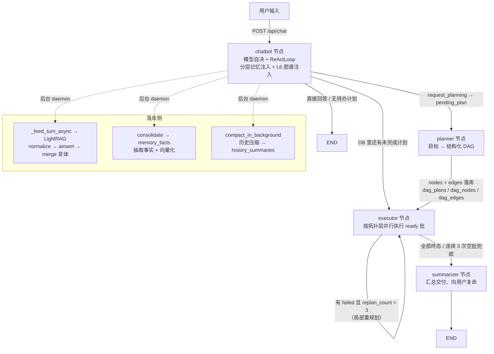

# 🤖 Agnes Agent

> 一个亲手搭建的 LangGraph 智能体：模型自决工具调用、分层记忆 + 知识图谱、多 Key 自动轮换、DAG 多步规划、沉浸式 Web 调试面板。
> 目标不是"调 API 出结果"，而是把 Agent 的"思考—行动—观察"循环一层层拆开，看明白再动手。

  

🛠️ **学习实验项目** —— 以理解 ReAct / LangGraph / LightRAG 机制为主要目的，欢迎提 Issue 交流，勿期待生产级稳定性。

---

## 📑 目录

- [效果演示](#-效果演示)
- [项目背景](#-项目背景)
- [核心特性](#-核心特性)
- [快速上手](#-快速上手)
- [多用户账号体系](#-多用户账号体系)
- [业务流程（从一次对话到记忆落库）](#-业务流程从一次对话到记忆落库)
- [模块架构（按 Agent 能力分类）](#-模块架构按-agent-能力分类)
- [设计思路与实现过程](#-设计思路与实现过程)
- [创作工作台（图片 / 视频生成）](#-创作工作台图片--视频生成)
- [企业微信接入（智能机器人）](#-企业微信接入智能机器人)
- [踩坑与解决实录](#-踩坑与解决实录)
- [实战案例：22 万条医疗问答全量入库](#-实战案例22-万条医疗问答全量入库本地嵌入--服务器替换)
- [项目文件结构](#-项目文件结构)
- [Roadmap 与致谢](#-roadmap-与致谢)

---

## 🎬 效果演示

启动后，终端会打出模型自决决策的日志；对话过程中每一次工具调用都会在 Web 面板上实时展示（工具名 + 参数 + 结果）。

```text
LLM 类型: <class 'app.llm.llm_factory.RotatingKeyChatOpenAI'> | provider=openai_compatible model=agnes-2.5-flash
🔍 控制面板: http://localhost:8081
[10:17:03] OK    控制台日志已启动（后台服务模式，对话请到调试面板）
[10:17:03] ▶ 节点开始 chatbot
🤖 你最近的完成任务有：1. 开发网页版贪吃蛇游戏 ……（Web 面板同步展示工具卡片与状态行）
```

Web 面板（默认 http://localhost:8081，被占自动顺延）：

- 左侧**历史会话**列表显示每条会话的最后一条用户消息，支持**批量删除**
- 发送框上方**状态行**实时显示正在执行的工具（`list_my_recent_tasks({...})`）
- 需要人工确认的工具（命令执行 / 文件写改删）弹出**审批卡片**，可每次询问 / 本次会话允许 / 永久允许
- 右上角**交付物 / 设置 / 知识库**入口：交付物页展示 Agent 生成的产出文件；知识库页管理 LightRAG 图谱（文档 / 分块 / 检索 / 问答反馈 / 数据看板）；设置页内含 State、提示词、追踪、记忆、Memory DB、定时任务、模型管理等调试能力

---

## 🧭 项目背景

**为什么做这个？** 自学 LLM 应用时发现"光调 API 太无聊"——想亲手实现一遍 Agent 的调度逻辑：模型怎么决定调哪个工具？工具结果怎么回到上下文？多轮循环怎么终止？记忆怎么跨会话留存？

**解决了什么问题？** 一个可本地运行的完整 Agent 骨架：对话 → 规划（DAG）→ 按拓扑层并行执行 → 验收契约校验 → 交付汇总，全程可观察、可审查、可切换模型。知识层用 LightRAG 建实体-关系图谱，随对话自然生长。

**标签**：🛠️ 学习实验项目 · 📚 概念验证。请不要把它当成生产框架来用。

---

## ✨ 核心特性

- ✅ **模型自决路由**：无硬编码意图分类，LLM 自行决定"直接回答 / 调工具 / 进入多步规划"
- ✅ **DAG 模式多步规划**：planner 把目标拆成 `nodes + edges`，executor 按拓扑层并行执行；支持软依赖、失败隔离、局部重规划（上限 3 次）与验收契约硬校验 —— 详见 [DAG 模式设计理念](#-dag-模式plan-and-execute设计理念)
- ✅ **自定义 ReAct 循环**：亲手实现思考—行动—观察闭环（`ReActLoop`），支持工具安全拦截、人工审批、连续拒绝熔断、迭代上限防死循环
- ✅ **分层记忆系统**：L1 对话消息（含工具调用事件） / L2 用户画像 / L3 任务历史（dag_plans） / L6 知识图谱 GraphRAG（实体关系图谱 + 混合检索，详见 [docs/l6-graphrag.md](docs/l6-graphrag.md)；原 L4 命令历史与 L5 语义缓存已并入 L1 事件与 L6 图谱）
- ✅ **实体归一化双保险**：入库前 `normalize_terms` 术语还原 + 入库后 `merge_entities` 图谱合并，抑制 LightRAG 大小写/拼写变体导致的实体节点膨胀（`RAG/Rag`、`GraphRAG/GraphRag` 等只留一个规范节点）
- ✅ **多 Key 自动轮换**：api_key 逗号分隔，限流/超时/鉴权自动换 key + 指数退避重试；**按用户隔离**——普通用户只用自己注册时提交的 Key，管理员（Mirror）使用全局 Key + 所有已激活用户的 Key 汇成轮询池
- ✅ **知识库（KB）管理**：文档/分块/检索/问答反馈管理，每库可覆盖分块策略与抽取指引；对话图谱默认**全局共享一张图**（所有会话读写同一命名空间 `__global__`，跨会话可共享每轮对话知识）；用户经 `kb_create` 显式创建的知识库是**独立命名空间**（`lightrag_storage/<kb_id>/` 自含目录/图谱/向量索引），消息框可**多选勾选**确定本轮 L6 检索范围——**勾了什么查什么，什么都没勾就什么都不查**（`__global__` 只是列表里的一项；默认一个都不勾，勾选结果存在浏览器 localStorage 下次自动恢复）；`GRAPH_NAMESPACE=per_thread` 可退回按线程隔离
- ✅ **技能系统（Skills）**：SKILL.md 即技能，命中本地装、不够用 SkillHub 在线搜装
- ✅ **沉浸式 Web 面板**：流式对话、工具状态行、审批卡片、State/日志/记忆/定时任务调试抽屉、模型一键切换
- ✅ **创作工作台（图片 / 视频）**：侧边栏品牌名下方一键进入，与对话页同壳切换（顶部 tab 图片 / 视频）；图片生成 + Agnes Video 2.5 Flash / V2.0 的文生视频 / 图生视频 / 首尾帧 / 关键帧 / 图片参考；异步任务前端轮询、完成即**自动下载 mp4 到服务器**（ffmpeg 抽帧封面 + ffprobe 读时长），作品库可回看 / 删除 —— 详见 [创作工作台](#-创作工作台图片--视频生成)
- ✅ **标准 cron 定时任务**：`*/5 * * * *` 常规 cron 语法驱动 Agent 周期性执行任务

---

## 🚀 快速上手

### 环境准备

- **Python 3.12+**
- 一个 **OpenAI 兼容网关**的 `base_url` + `api_key`（模型凭据在 Web 面板设置页接入，不写死在代码里）
- 可选：Tavily API Key（联网搜索）

### 安装

```bash
git clone <repo-url> && cd Agnes-Agent
python -m venv .venv

# Windows
.venv\Scripts\activate
# macOS / Linux
source .venv/bin/activate

pip install -r <(uv export --format requirements)   # 或按 pyproject.toml 安装依赖
```

### 最小运行

```bash
python -m app.main
```

启动预期输出（片段）：

```text
LLM 类型: <class 'app.llm.llm_factory.RotatingKeyChatOpenAI'> | provider=openai_compatible model=agnes-2.5-flash
🔍 控制面板: http://localhost:8081
[10:17:03] OK    控制台日志已启动（后台服务模式，对话请到调试面板）
```

> `python -m app.main` 现在是纯后台服务模式（无终端对话循环），与 `python -m app.service` 基本等价，但端口被占时会自动顺延到 8082+。遗留参数 `--new` 可开启新会话。

打开 http://localhost:8081 即可使用。**首次打开调试面板时会引导你设置首个管理员账号（admin）**——凭据以 PBKDF2-SHA256（12 万轮 + 随机 salt）存入 `data/accounts.db`（已 `.gitignore`，不含明文密码）。其余用户在登录页「注册新账号」提交后，由管理员在 **设置 → 用户管理** 中审批通过/拒绝。若设置了 `.env` 的 `AGENT_USERNAME` / `AGENT_PASSWORD`（两个都填才生效），则视为管理员凭据，适合无人值守部署。首次使用先到右上角 **设置 → 模型** 页接入你的模型（填 Base URL + API Key，可自动拉取模型列表）。

> `.env` 只放非模型密钥（如 `TAVILY_API_KEY`）；模型凭据统一在 `data/.model_config` 由设置页管理。
>
> 创作工作台另有可选环境变量 `AGNES_PUBLIC_BASE_URL`（如 `http://god.makeup:8081`）：仅当上游拒收内联 Data URI、需要公开素材地址时作为兜底基址（见[创作工作台](#-创作工作台图片--视频生成)）。

### 服务模式（HTTP 常驻 + 后台服务）

Agent 以常驻服务方式运行，**没有终端对话循环**——对话、审批、定时任务全部走 Web 调试面板：

```bash
python -m app.main                          # 后台服务（调试面板默认 8081，被占自动顺延）
python -m app.service                       # 同服务模式，默认 0.0.0.0:8081，开启热重载
python -m app.service --port 9000           # 改端口
python -m app.service --no-reload           # 关闭热重载
python -m app.service --new                 # 开新会话（新的 thread_id）
```

预期输出（片段）：

```text
🔍 控制面板: http://localhost:8081
[thread_id] a1b2c3d4-...
[10:17:03] OK    控制台日志已启动（后台服务模式，对话请到调试面板）
[10:17:03] ▶ 节点开始 chatbot
[10:17:03] LLM    planning  1.2s
[10:17:03] TOOL   [chatbot] tavily_search {'query': '...'}
[10:17:03] EXEC   node_1 → success
[10:17:03] OK    任务交付汇总完成 · 2 个产物
```

- **纯 HTTP 驱动**：没有终端输入循环，对话/审批/定时任务全部走 Web 面板（`/api/chat`、`/api/scheduler` 等）；
- **控制台日志**：节点/模型调用/工具/规划/任务等事件以彩色一行实时打印，方便在终端观察 Agent 工作过程；
- **端口固定**：`app.service` 被占用直接报错，不再自动顺延（`app.main` 仍自动顺延）；
- **热重载**：修改 `app/` 目录下的 `.py` 文件，或改 `data/.model_config`（模型配置）后自动重建 graph 并重启，无需手动重启进程。只监控 `app/` 与 `.model_config`，`data/*.db`、`traces/` 等运行期写入不会误触发重启；
- 服务模式与 `app.main` 共用 `.thread_id` 文件与 SQLite 存储，会话、记忆天然连续。

### 部署为开机自启服务（Linux systemd）

```bash
sudo useradd --system --home /opt/agnes-agent agnes   # 首次：创建运行用户
sudo chown -R agnes:agnes /opt/agnes-agent
sudo cp deploy/agnes-agent.service /etc/systemd/system/
sudo systemctl daemon-reload
sudo systemctl enable --now agnes-agent               # 开机自启 + 立即启动
journalctl -u agnes-agent -f                          # 看日志
```

> 服务默认**保留热重载**（改 `app/` 代码或 `data/.model_config` 自动重建）；生产环境想关闭可给启动命令追加 `--no-reload`。脚本/单元文件里的端口、路径按需修改。

---

## 👥 多用户账号体系

从 2026 年起项目支持**多用户**：不只共享一个面板，而是每个用户拥有独立的数据、密钥、会话、记忆与知识库。账号数据在 `data/accounts.db`（PBKDF2-SHA256 哈希 + 随机 token 会话，登录态 7 天有效）。

**角色与状态**

| 角色 | 说明 |
|---|---|
| `admin` | 首个 `setup` 创建的管理员；可审批用户、管理全局模型配置、执行 `/api/git/*`、定时任务与自动快照 |
| `user` | 普通用户：填 Key 注册 → 等待管理员审批 → 登录后独立使用面板 |

用户状态：`pending`（注册待审批，无法登录）/ `active`（可用）/ `rejected`（被拒绝，登录返回 403 + 原因）。

**注册 → 审批流程**

1. 登录页点「注册新账号」：填写账号、密码、**Agnes API Key** 与**硅基流动 API Key**（会即时做一次可用性校验）。
2. 提交后状态为 `pending`，页面提示「等待管理员审批」。
3. 管理员在 **设置 → 用户管理** 中查看 / 通过 / 拒绝；通过后该用户即可登录。

**每用户隔离**

每个用户都落在 `data/users/<username>/` 下，内容互不可见：

```
data/users/<username>/
├── data/                  # memory.db 记忆库、checkpoints.db 会话检查点
├── uploads/               # 图片/文件上传（前端按 /api/uploads/<name> 渲染）
├── deliverables/          # Agent 生成的交付物
├── lightrag_storage/      # 该用户专属的知识图谱（L6 与 KB 命名空间）
├── skills/                # 该用户安装的技能（内置技能对所有用户可见）
├── .thread_id             # 当前会话 thread_id（缺省 "default"）
└── .approval_mode         # 审批模式：per_ask / session_allow / always_allow
```

- **Key 策略**：普通用户仅使用自己提交的 Agnes / 硅基流动 Key（embedding、rerank、对话推理都走本人 Key，加密存储、不出现在前端）；管理员全局 Key + 所有 active 用户的 Key 组成轮询池。`/api/models` 对非管理员一律脱敏为 `****xxxx`。
- **权限边界**：工具层对非管理员隐藏 `execute_command`（命令执行）与 `tavily_search`（联网搜索）；`/api/git/*`、`/api/scheduler`、自动 git 快照仅管理员可用；非管理员每次对话写入自己 `data/users/` 下的工作区，不会产生仓库级 commit。
- **审批模式**：每次询问 / 本次会话允许 / 永久允许，按用户单独记忆（`.approval_mode`），互不继承。
- **迁移**：升级自旧版（单用户）时，服务启动会把仓库级 `data/`、`lightrag_storage/` 等旧数据自动迁移到 `data/users/Mirror/`，管理员即旧版用户，无缝衔接。

---

## 🔄 业务流程（从一次对话到记忆落库）

**一条消息进来之后，Agent 里发生了什么？** 下面按"链路"切分，前两条是高频主路径（对话 + 规划），后两条是落库侧（记忆 + 图谱）。

### 链路 ① 新增对话入库全链路（主路径）

```
POST /api/chat {message, thread_id}
  └─ chat.py 构造 inputs = {"messages":[("user", message)]}
  └─ graph.stream(configurable.thread_id)  →  START → chatbot 节点
```

**chatbot 节点（`graph/builder.py`）内部分步骤：**

| 步骤 | 代码位置 | 做什么 |
|---|---|---|
| 1. 定位会话 | `set_current_context(thread_id)` | 让 L6 图谱工具（record_graph / lightgraph_query）知道当前会话 |
| 2. 落库用户消息 | `mm.add_message(thread_id, "user", ...)` | L1 messages 表（60s 幂等去重，防 interrupt/resume 重放重复插入） |
| 3. 拼 system prompt | `load_prompt_template()` + 技能清单 | 主模板填 `{{os}}/{{cwd}}/{{deliverables_dir}}/{{skills_section}}` |
| 4. 分层记忆注入 | `mm.build_memory_injection(...)` | **history_summary**（Stanford 三因子排序摘要）+ **L2** 用户画像/偏好 + **L3** 近期任务 + **facts** 高价值长期记忆，拼入"=== 分层记忆注入 ==="块 |
| 5. L6 图谱注入 | `get_l6_context(thread_id, user_content)` | 当前问题对 LightRAG 混合检索，命中实体/关系摘要也拼进 prompt |
| 6. 思考—行动 | `ReActLoop.run(...)` | 模型调工具 → `on_tool_before` 安全检查 / `interrupt_handler` 审批 → `on_tool_after` 副作用写入；循环直到无工具调用或达 `MAX_TOOL_CALL_ROUNDS` |
| 7. 落库助手回复 | `mm.add_message(thread_id, "assistant", content)` | 清洗 `<tool_call>` 残留后写入 messages 表 |
| 8. L6 全量喂养（后台） | `_feed_turn_async(thread_id, user, assistant)` | daemon 线程 → `lightrag_insert`，见[链路 ④](#-业务流程从一次对话到记忆落库) |
| 9. 长期记忆固化（后台） | `memory_engine.consolidate(...)` | 后台线程 LLM 抽取事实/偏好，见[链路 ③](#-业务流程从一次对话到记忆落库) |
| 10. 历史压缩（后台） | `compact_in_background(...)` | 消息 token 超预算阈值时，`messages[:-30]` 压成摘要写 `history_summaries` |
| 11. 回复防刷屏 | `apply_reply_guard(...)` | 连续异常回复熔断：首次照常写、第二次替换提示、其后跳过写入 |
| 12. git 快照 | `auto_snapshot(...)` | 本轮对代码/交付物的改动自动 commit |

**chatbot 退出后路由（`route_after_chatbot`）：**

```
pending_plan 有值 ──► planner（多步规划）
DAG 有未完成节点 ─► executor（继续执行）
否则 ───────────► END（本轮直接回答完成）
```

随后 chat.py 的 SSE 双通道把结果推给前端：`updates` 通道按节点推状态（含 summarizer 的 final 兜底文本），`messages` 通道推 token 打字机效果。

### 链路 ② 多步规划 DAG（request_planning → 执行 → 汇总）

```
用户："帮我做网页版贪吃蛇"
  └─ chatbot 里模型调 request_planning(目标) → 返回即写 pending_plan
  └─ route_after_chatbot → planner 节点
```

1. **planner**（`dag_planner.py`）：把目标喂给 LLM，产出 `{"nodes": [...], "edges": [...]}`；
2. **dag_core** 规范化：丢弃悬空边 / 去重边 → DFS 三色环检测（成环回喂模型重规划一次，仍成环退化为单节点计划）→ 落库三表 `dag_plans / dag_nodes / dag_edges`；
3. **executor**（`dag_executor.py`）：每次进入 = 一轮批处理 —— 回收 dangling `running` → 算失败传播/软依赖/当前 ready 批 → **同层节点线程池并行执行**，单节点内部是一次完整 `ReActLoop`（`max_iterations=12`，必须显式 `complete_node`/`fail_node` 收尾，不允许"默默结束"）；
4. **验收契约**：`complete_node` 调用时校验——`expected_artifacts`（planner 声明的产出路径）必须出现在 `files` 里且真实落盘，否则拒绝并回喂原因；
5. **路由**（`route_after_executor`）：还有未完成 → 继续 executor；有 `failed` 且 `replan_count < 3` → 局部重规划（只重做失败子图，`replaces` 记录替代关系）；全部终态 → summarizer；
6. **summarizer**（`dag_summarizer.py`）：汇总各节点结果 + **真实落盘**的产物；存在 failed 节点时**不调 LLM**，直接结构化说明，杜绝"把失败讲成成功"。最终答复走 SSE `step=final`。
7. 路由回 chatbot，用户继续对话。

### 链路 ③ 长期记忆固化（consolidate）

```
memory_engine.consolidate(thread_id, user, assistant, llm, extract=True)
  └─ extract_facts：把「用户：… 助手：…」喂 LLM，出 JSON ops：
       [{op: add/update/delete, category: fact|preference|identity|relation|project,
         content, importance, conflict_detection}]
  └─ apply_fact_ops：写 memory_facts 表（content 唯一，幂等）
  └─ index_texts("fact")：embedding → memory_facts.embedding（向量直存权威表）
```

- **遗忘衰减 daemon**（`start_decay_daemon`，默认每 6 小时）：importance 随时间 *0.995^days 衰减；最近 3 天访问过的记忆**升温**不衰减；跌破 `min_importance=2.0` 删除——"越用越重要，不用就忘"。
- **检索侧**：`search_my_memory` 工具 / `build_memory_injection` 的 facts 层，都只查 `memory_facts` + `dag_plans`（人的记忆），**不含对话原文**——原文的实体关系由 L6 图谱独占，两套检索数据源不重叠。

### 链路 ④ L6 知识图谱入库（lightrag_insert）

```
_feed_turn_async(thread_id, user, assistant)   // 每轮对话全量喂养（daemon 线程）
  └─ lightrag_insert(thread_id, [text])
       ├─ 1. normalize_terms(text)           // 术语还原：Rag→RAG、GraphRag→GraphRAG…
       ├─ 2. rag.ainsert(texts)              // 在专属 worker 事件循环上调用（_run_on_worker）
       │      └─ chunking（策略可配）→ LLM 抽取实体/关系
       │           （entity_types_guidance 注入 prompt，见 模块架构/LLM 层）
       │      └─ 向量化（EmbeddingFunc）→ 写 NanoVectorDB / Faiss
       │      └─ 图谱合并（同名字节可接，仅完全同名去重）
       └─ 3. merge_entity_variants(thread_id)  // 后置合并：把漏网的
              GraphRag/Graphrag… 节点 amerge_entities 并成 GraphRAG
              （边自动重定向、描述保留）
```

- **为什么双保险**：LightRAG 按 chunk 独立抽取，每个 chunk 的 LLM 都看不到其他 chunk 命名 → `RAG`/`Rag`/`GraphRAG/GraphRag` 会各自成节点。前置术语还原从源头压掉变体，后置图谱合并把依然生成的变体节点在图上合并。
- **读取侧**：`lightgraph_query`（混合检索，向量 + 图谱双路召回）/ `get_l6_context`（每轮被动注入）/ `/api/graph/nodes|edges`（全网快照，前端渲染实体关系视图）。
- **KB 管理**：`kb_ingest`（文档/文本/URL 导入）、`kb_reprocess`（重建）、`kb_edit_chunk`（改分块）、`kb_feedback`（问答反馈）。图谱默认全局唯一，`kb_meta.json` 落在全局命名空间下，可覆盖分块策略 / top_k / 抽取指引。
- **存储**：`lightrag_storage/<ns>/`（JsonKV + NetworkX GraphML + NanoVectorDB/faiss 向量索引），`ns = _graph_ns(thread_id)` —— 默认全部收敛到全局命名空间 `__global__`（所有会话/库共享一张图，重启不丢）；`GRAPH_NAMESPACE=per_thread` 时 `ns=thread_id` 按线程独立。

---

## 📦 模块架构（按 Agent 能力分类）

### 1️⃣ 模型层（LLM）· `app/llm/`

| 模块 | 实现方式 |
|---|---|
| `llm_factory.py` | **多 Key 轮换 + 指数退避重试**。`RotatingKeyChatOpenAI`：401/429/5xx/网络/超时 → 换下一个 key；一轮全部失败走 `2^n + jitter`（上限 30s）重试；**400 立即抛不重试**；流式只重"连接建立阶段"（token 已推不重试，避免前端重复）。单 key 也走轮换骨架享受退避保护。`create_llm` 是纯工厂：只认 OpenAI 兼容格式，不读 `.model_config`、不内置厂商凭据 |

### 2️⃣ 上下文层（Context）· `app/graph/`

| 模块 | 实现方式 |
|---|---|
| `state.py` | 极简 LangGraph State：`messages`（add_messages）+ `thread_id` + 触发器 `pending_plan` + 验证反馈字段。**DB 才是唯一真相源**，state 只做节点间管道 |
| `builder.py` | 节点编排 + 条件路由。`chatbot` 统一入口（模型自决：直答 / 调工具 / 规划）。路由决策全部读 DB（任务进度），state 只传标识。见[链路 ①](#-业务流程从一次对话到记忆落库) |
| `utils.py` | token 预算（`ensure_token_limit` 裁剪）、消息上下文组装（`prepare_context_messages`：退化尾巴清理 + 结构清洗 + 按完整回合裁剪，不拆散 assistant↔ToolMessage）、回复防刷屏守卫（`apply_reply_guard`）、prompt 模板加载 |
| `_agent_prompt.py` | 跨节点共享 prompt 片段：`EXECUTION_DISCIPLINE`（完成即停/同参不重复/搜索克制）、`SAFETY_RULES`（deliverables/ 落盘约束、禁写核心路径）、`OUTPUT_FORMAT`、`MEMORY_GUIDE`。planner/executor 拼接继承，避免各自维护漂移 |
| `prompt_template.txt` | 主 chatbot 系统提示模板：角色、工具策略、安全、输出格式 + 四个占位符 `{{os}}/{{os_cmds}}/{{cwd}}/{{deliverables_dir}}/{{skills_section}}` |
| `memory/compaction.py` | 历史压缩（context engineering）：只看"实际发送预算"占比触发（不再用时间兜底），只压 `messages[:-30]`，后台线程执行，写 `history_summaries` 不改 state |

### 3️⃣ 工具层（Tools）· `app/tools/`

| 工具 | 分类 | 实现/约束 |
|---|---|---|
| `ls` / `read_file` / `write_file` / `edit_file` / `delete_file` / `glob_files` / `grep_files` | 文件操作 | 纯 Python 包装（`file_ops.py`），**无需审批**；路径限项目目录内，写入限 `deliverables/`，越界即拒绝并回喂 ToolMessage |
| `execute_command` | 命令执行 | 子进程执行 + 输出解码（Windows GBK/UTF-8 兼容）；**需人工审批** |
| `tavily_search` | 联网搜索 | 搜索结果自动 `_try_ingest_lightrag` 被动入图（调用后钩子） |
| `update_user_info` / `update_user_preference` | 用户画像写 | 调用后钩子写 L2：`user_profile` / `user_preferences` |
| `search_my_memory` / `list_my_recent_tasks` / `get_command_history` | 记忆读取 | 语义检索 facts+tasks / 任务历史（dag_plans）/ L1 工具调用事件 |
| `request_planning` | 规划触发（元工具） | 返回 `Command(update={"pending_plan": 目标})` → state 注入 → 路由跳 planner |
| `record_graph` / `lightgraph_query` | L6 图谱 | 显式三元组建图 / 图谱混合检索（见 `memory/graph_rag_tool.py`） |
| `list_skills` / `read_skill` / `search_skillhub` / `install_skill` | 技能路由 | 技能清单注入 prompt / 读 SKILL.md / SkillHub 在线搜索 / 一键安装 |

> 工具定义全部集中注册于 `tools/__init__.py` 的 `tools` 列表；`bind_tools` 一次注入给所有节点。安全拦截在 `on_tool_before`（危险命令关键字）、审批在 `interrupt_handler`（per_ask 模式中断）、副作用在 `on_tool_after`。

### 4️⃣ 规划层（Planning）· `app/planning/`

| 模块 | 职责 | 实现方式 |
|---|---|---|
| `react_loop.py` | 思考—行动—观察循环 | 自实现：`on_tool_before` 安全拦截 / 审批 interrupt / 连续 3 次同调用熔断、连续拒绝熔断（`_reject_count`）、连续无进展计数强制 break、`max_iterations` 防死循环；纯文本永远不算完成（require_final_marker，executor 用） |
| `dag_core.py` | DAG 计算内核（纯函数） | 规范化（丢悬空边/去重边）、DFS 三色环检测、Kahn 拓扑分层、ready 批计算、失败传播（强依赖失败→迭代传播标 skipped）、验收契约解析（`expected_artifacts` 兼容 Windows 路径） |
| `dag_planner.py` | 目标 → 结构化 DAG | LLM 出 `nodes`/`edges` → 规范化 → 环检测（成环请求重规划一次，再成环退化为单节点计划）→ 落库 |
| `dag_storage.py` | DAG 持久化（SQLite） | 三表 `dag_plans/dag_nodes/dag_edges` + 轻量 checkpoint（重启从最近状态继续）；回收悬空 `running`；文本字段入库前统一 `_as_text` 归一 |
| `dag_executor.py` | 按拓扑层并行执行 | `ThreadPoolExecutor` + `BoundedSemaphore` 同层并行；单节点复用 `ReActLoop`；`complete_node/fail_node` 终止工具 + 验收契约硬校验（`_has_real_artifact`）；失败前缀补上下文（`_missing_soft`）；窄重规划入口 |
| `dag_summarizer.py` | 交付汇总（复命） | 汇总节点结果 + **真实落盘**产物（跳过 deleted）；存在 failed 节点不调 LLM 直接结构化说明；结果写 `AIMessage` → SSE `step=final` → 前端无条件覆盖气泡 |

### 5️⃣ 记忆层（Memory）· `app/memory/`

| 模块 | 职责 | 实现方式 |
|---|---|---|
| `memory_manager.py` | 分层存储 + 注入 | SQLite 权威表：`messages`（L1）/ `user_profile`+`user_preferences`（L2）/ `dag_plans`（L3）/ `memory_facts`（长期记忆，**向量直存本表**，废弃冗余 memory_chunks 表）；`build_memory_injection` 按层聚合注入 prompt：history_summary（Stanford 三因子 Recency+Importance+Relevance 排序）/ L2 / L3 / facts（≥6 高价值常驻） |
| `memory_engine.py` | 记忆固化 + 语义检索 + 遗忘 | `consolidate`（后台线程 LLM 抽取 facts → 冲突检测 → 写库 → 建向量）；`search_semantic`（余弦 + 可选 rerank 精排，兜底 SQL LIKE，只查 fact/task）；`decay_memory_facts` + `start_decay_daemon`（遗忘衰减，越用越重要） |
| `compaction.py` | 历史压缩 | 见[上下文层](#2️⃣-上下文层context--appgraph) |
| `graph_rag_tool.py` | L6 图谱工具 + 注入 | `record_graph`（三元组→文本入图）/ `lightgraph_query`（混合检索）/ `_feed_turn_async`（每轮全量喂养，daemon）/ `get_l6_context`（被动注入 prompt，失败静默降级） |
| `ligraphrag_adapter.py` | LightRAG 桥接 | **专属 worker 事件循环**跑 `ainisert/aquery`（`_run_on_worker` 跨线程桥）；Embedding(vstack) / Rerank / 主模型 LLM 三件套包装；图谱命名空间解析 `_graph_ns`（默认全局共享一张图，`GRAPH_NAMESPACE=per_thread` 按线程隔离）；KB 配置覆盖（分块策略/top_k/抽取指引）；`merge_entity_variants` 后置合并 |
| `entity_normalizer.py` | 术语归一化 | 别名表 `_TERM_ALIASES`（RAG/KAG/OAG/GraphRAG/LLM/OpenSPG 的大小写、缩写、全称变体）→ **ASCII 词边界正则**（lookahead/lookbehind 而非 `\b`，因为 `\b` 对 CJK 无效，会漏掉"了解GraphRag"这类中英混排前缀）→ `normalize_terms` 词级还原 |

### 6️⃣ 技能层（Skills）· `app/skills/`

| 模块 | 实现方式 |
|---|---|
| `loader.py` | 扫描 `app/skills/<name>/SKILL.md`（YAML frontmatter 元数据 + 步骤正文）→ 每轮注入 system prompt → 模型调 `read_skill` 读全文后严格按其步骤执行 |
| `hub.py` | SkillHub 在线市场客户端：`search_skillhub` 搜索 → 用户确认 → `install_skill` 下载即装（立即可用） |
| `agnes-media/` | 内置示例技能（媒体处理） |

### 7️⃣ 服务层（Server/API）· `app/server/`

| 模块 | 实现方式 |
|---|---|
| `api/chat.py` | 对话 API：SSE **双通道**——`updates`（节点状态，含 final 兜底）+ `messages`（token 打字机）；内部 LLM 输出过滤（`_filter_internal_tokens`，按摘要结构 marker 前缀丢弃 update_summary 泄漏的 token）；事件监听桥把 ReActLoop 的工具完成事件实时转 SSE tool 事件；resume 审批决策 |
| `store.py` | 全局 `_GRAPH/_CONFIG`、日志落库（`app_logs`）+ `add_event` 事件流、State 快照、会话删除 |
| `api/system.py` | `/api/state` `/api/prompt` `/api/logs` `/api/events` `/api/trace` `/api/sse` 调试接口 |
| `api/kb.py` | 知识库 CRUD：文档/分块/检索/反馈/看板（见[链路 ④](#-业务流程从一次对话到记忆落库)） |
| `api/memory.py` / `api/tools.py` / `api/graph.py` / `api/skills.py` / `api/git.py` / `api/upload.py` | 记忆 / 工具白名单 / 图谱快照 / 技能浏览 / git 操作与交付物 / 文件上传 |
| `config.py` | 模型目录管理（自定义来源，无内置厂商；写入 `data/.model_config`） |
| `console_log.py` | 控制台彩色一行日志（节点/模型/工具/规划/任务事件） |
| `git_ops.py` | 自动 git 快照（每轮对话完把本轮改动 commit） |
| `auth.py` | PBKDF2-SHA256（12 万轮 + 随机 salt）账号认证 |

### 8️⃣ 入口与配置

| 模块 | 实现方式 |
|---|---|
| `main.py` | 入口：后台服务模式（自动顺延端口）；build_graph/set_graph 失败时打印 `[startup error]` + traceback + 落库日志兜底，不崩进程 |
| `service.py` | 服务模式：HTTP 常驻 + `--reload` 热重载（只监控 `app/` 与 `.model_config`） |
| `config.py` | 路径中心（`DB_PATH` / `CHECKPOINT_DB_PATH` / `PROMPT_TEMPLATE_PATH` 统一指向 `data/`） |
| `trace.py` | 会话级 trace：节点/工具调用写入 `traces/<thread_id>.jsonl`（调试面板追踪页读取） |

---

## 🧠 设计思路与实现过程

### 架构总览（服务模式）



> 所有路由决策**读 DB 而非 state**：`dag_plans` / `dag_nodes` 是任务进度的唯一真相源，LangGraph 的 state 只传标识与消息。这样"进程重启后接着跑"和"多轮会话续聊"无需额外机制。

### 技术选型理由

- **为什么用 LangGraph？** 需要 checkpoint 中断/恢复来支撑"审批挂起"和"多轮会话续聊"，手写状态机成本太高。
- **为什么工具执行不用 LangGraph 的 ToolNode，而是自写 ReActLoop？** 想亲手实现工具调度的完整细节：安全拦截、审批、拒绝熔断、`request_planning` 之类的"元工具"返回值透传——这些在 ToolNode 里会被框架隐藏。
- **为什么 SSE 用双通道（updates + messages）？** 流式 token（messages）负责打字机效果，节点状态（updates）负责最终文本兜底与审批事件。
- **为什么用 LightRAG 而不自己写图谱？** 实体/关系抽取是 LLM 的活，LightRAG 管 chunking → LLM 抽取 → 向量化 → 图持久化闭环，我们只做桥接 + 归一化优化（实体双保险）。

### 🧬 DAG 模式（Plan-and-Execute）设计理念

这一节是规划能力的核心：**为什么多步任务不用"线性子任务列表"，而用"DAG + 状态机 + 局部重规划"**。

#### 1. 动机：线性计划在真实任务上会碎

最早让 planner 输出线性列表（step1 → step2 → …），立刻撞上三类问题：

| 线性列表的问题 | 真实任务的形态 | DAG 的解法 |
|---|---|---|
| 无法表达"谁依赖谁" | "写完 HTML 才能校验它" | `edges` 显式声明依赖方向 |
| 只能串行，慢 | "查资料"与"搭骨架"互不依赖，可同时做 | Kahn 分层 → 同层并行执行 |
| 一个子任务挂了整条链报废 | 删掉某个锦上添花的节点不该影响主流程 | 软依赖（`soft` 边）不阻塞后继，只标注"缺数据" |

#### 2. 四层模型

把 DAG 能力拆成四层，每层职责单一、可单独测试：

| 层 | 做什么 | 落在哪里 |
|---|---|---|
| ① 结构化计划 | 模型输出 nodes + edges → 规范化成可调度 DAG | `dag_planner.py` + `dag_core.normalize_nodes` |
| ② 校验与排序 | 环检测（DFS 三色）、拓扑分层（Kahn） | `dag_core.detect_cycle` / `topo_layers` |
| ③ 状态机与失败传播 | six-state + 软依赖 + 失败隔离 | `dag_storage.py` + `dag_core.compute_*` |
| ④ 局部重规划 | 只重做受影响的子图，不推翻已完成的工作 | `route_after_executor` 触发 + executor 入口 replan |

**关键取舍：为什么环检测交给"重规划"而不是自动断边？**
断边等于替用户猜意图（砍哪条依赖都是错的）。成环说明这次规划没想清楚，正确做法是把环信息回喂模型**重规划一次**；仍成环则退化为单节点直行——保证任务永远能往下走，而不是卡死（`dag_planner.py:88-99`）。

#### 3. 状态机与失败传播

```text
pending ──(强依赖父全部 success)──► ready ──► running ──► success
   │                                              └──► failed ──► 触发局部重规划
   └──(任一强依赖父 failed)──► skipped（连带失效，不再执行）
```

- **ready 批判定**（`compute_ready_batch`）：只看"强依赖父是否全部 success"；软依赖父失败不阻塞，但把"缺数据"写进节点上下文。
- **失败隔离**（`compute_failure_skips`）：强依赖失败 → 迭代传播到稳定；无关分支完全不受影响，软依赖后继不跳。
- **running 悬空回收**（`recover_stale_running`）：进程被杀/重启后 DB 残留 `running`，executor 每轮入口按超时判为 `failed`。

#### 4. 局部重规划（④）：只重做坏掉的那一段

1. `route_after_executor` 发现"仍有 failed 节点，且 `replan_count < MAX_REPLAN(3)`" → 再次进入 executor；
2. executor 入口做**窄重规划**：仅把 failed 节点及其强依赖后继摘出来交给 LLM 重出这一段；
3. 新节点替换回原 DAG（`replaces` 字段记录"谁替代了谁"），其余 `success` 节点原地不动；
4. 上限 3 次，用完交给 summarizer **如实汇报失败**。

> 实测教训（`builder.py:435-446`）：`failed` 分支必须写在"unfinished 为空"判断**之后**。缺了它时"一批节点全失败 → unfinished 为空 → 直接收敛"，重规划上限形同虚设。

#### 5. 不许"假完成"：验收契约（acceptance_criteria）

- planner 被要求在 `acceptance_criteria` 里写明**产出文件路径**；
- executor 执行前解析出 `expected_artifacts` 写进节点 system prompt；
- `complete_node(files=[...])` 是终止工具，但调用时会被拦截校验：
  - 没有"真实存在于磁盘"的产物 → 拒绝，并把拒绝原因回喂模型；
  - 声明产物没出现在 `files` → 契约未满足，同样拒绝。
- 结果是"假完成"尽量在**节点内**被发现并当场改正。

#### 6. 执行器：同层并行 + 单节点 ReAct

`dag_executor.py` 每进入一次 executor 节点 = 一轮批处理：

1. 读 plan/nodes/edges，回收 running 悬空；
2. `dag_core` 算失败传播、软依赖、当前 ready 批；
3. **同层并行**执行（`ThreadPoolExecutor` + `BoundedSemaphore` 限并发），节点内部是一次完整 `ReActLoop`（`max_iterations=12`，`terminate_tools={"complete_node", "fail_node"}`）；
4. 结果写回 DB 并 `save_checkpoint`（重启可从最近状态继续）；
5. 推送 DAG 结构 / 节点状态 / replan 事件给前端。

单节点内工具硬约束（`_on_tool_before`）：探索类 ≤2 次、写入类 ≤8 次、产物路径必须落在 `deliverables/`。

#### 7. 交付汇总：必须有人"复命"，且不许美化失败

- 汇总各节点结果，**跳过 `skipped`** 的作废节点；
- 产物只保留**磁盘上真实存在**的文件；
- **存在 failed 节点时不调 LLM**，直接结构化说明（"任务未完全完成：N 个失败 + 失败项 + 已产出"）；
- 汇总写 `AIMessage` → SSE `step=final,node=summarizer` → 前端**无条件覆盖**当前气泡。

> 易踩语义坑：交付汇总**不写 `history_summaries` 表**——那张表的语义是"历史对话压缩摘要"（compaction.py 写入），任务汇报混进去会让记忆注入层读到错误语义。

#### 8. 失败与并发之外：还有哪些"防呆"

| 场景 | 处理 |
|---|---|
| 节点永不 ready | 连续 3 次空批（`_empty_streak >= 3`）→ 进 summarizer |
| 模型输出非法 JSON | 降级为单节点计划，任务照跑 |
| 边引用不存在节点 / 重复边 | `normalize_nodes` 丢弃并记 warning |
| 写库字段类型不对 | 入库前统一 `_as_text` 归一 |
| 前端渲染大量事件卡死 | 过程事件按"轮"聚合成一行摘要；待办面板拓扑分层收敛 |

#### 设计检查清单（改 DAG 相关代码时照着过一遍）

- [ ] 新逻辑是否保持"DB 是唯一真相源"（state 只放标识与消息）？
- [ ] 新的失败路径会被 `compute_failure_skips` 正确传播吗？软依赖有没有被误伤？
- [ ] 新的重规划入口受 `MAX_REPLAN` 约束吗？有没有可能无限循环？
- [ ] 新的写库字段做过归一吗（SQLite TEXT 只接受 str/bytes/None）？
- [ ] 前端新事件在两种显示模式下都不会退化吗（正文必须可见、最新输出在底部）？

---

## 🎬 创作工作台（图片 / 视频生成）

侧边栏品牌名下方的 **🎬 创作工作台** 与对话页同壳切换（顶部 tab：图片 / 视频），进入创作不会打断当前会话的上下文。

### 图片

- 复用 agnes 网关的多 Key 轮换（`.model_config` 中 base_url 含 `agnes-ai` 的 provider，`api_key` 逗号分隔；退化到 `skills/agnes-media/keys.json`）；
- 产物落盘 `data/image_library/`，删除走 `POST /api/image/delete`。

### 视频（Agnes Video 2.5 Flash / V2.0）

- 后端 `app/server/api/video.py`，端点：`GET /api/video/status`、`POST /api/video/generate`、`GET /api/video/task/{id}`、`GET /api/video/history`、`GET /api/video/file/{id}?thumb=1`、`POST /api/video/delete`；
- 异步任务：创建拿到 `video_id` → 前端每 3s 轮询 `task/{id}` → 上游 `completed` 后**自动下载 mp4 到 `data/video_library/`**（`ffmpeg` 抽帧封面 + `ffprobe` 读时长）；文件用 `FileResponse` 流式返回（starlette 支持 Range，可直接拖进度条）；
- 创建按 key 轮换（429 / 5xx 换下一个 key，4xx 参数错误立即抛出），查询沿用创建时的同一个 key；
- **参考图一律内联 Data URI**：实测 flash 的 `first_frame` / `last_frame` / `images` 与 v2.0 的 `image` / `extra_body.image` 都接受 Base64 / Data URI，**不需要公网地址**；
- 兜底：若上游仍以「载体必须是公开 http(s) URL」拒收，则把图片复制到 `data/video_ref/` 并经公开挂载 `/pub/video-ref` 暴露，公开地址取 `AGNES_PUBLIC_BASE_URL`（优先）或本次请求的 `request.base_url`。

> ⚠️ 素材体积不能过小：纯色小图（base64 仅数百字符）会被上游判为「非法载体」并返回 HTTP 400；正常照片（base64 数 KB 以上）没有这个问题。

### 移动端（手机）适配

对话页 / 设置抽屉 / 创作工作台三处共用一套断点，全部纯 CSS（`style.css` 末尾的移动端区块），不改 JS 逻辑：

- **对话页（≤767.98px）**：会话栏改抽屉（`#btnSidebar` 滑出 + `.sidebar-mask` 遮罩）、顶栏按钮收成纯图标、审批模式收成「当前生效」胶囊、输入框 16px 防 iOS 聚焦缩放；
- **设置抽屉（≤767.98px）**：桌面端是「左侧 268px 标签栏 + 右侧内容」，手机上横向排不下（内容只剩 ~24px）→ 改为**顶部横向可滚动标签条 + 全宽内容**（`flex-direction: column` + `.drawer-tabs` 横排、`overflow-x: auto`）；抽屉内的 **RAG 管理台**同样是两栏结构，一并改成顶部标签条；表单 `.d-row` 允许换行，避免控件被压成一条；
- **创作工作台（≤720px 布局 / ≤1000px 触控目标）**：顶栏紧凑化（≤420px 隐藏标题把宽度让给「图片 / 视频」切换）、模式选择由 3 列小卡片改为**整行列表**（说明文字不再折行）、作品库网格 132px 起自适应、速选 chip 与小按钮点击区 ≥32px、生成按钮整行 44px；
- 触控目标统一 ≥30px、正文控件 16px（iOS Safari 对 <16px 的输入框会自动放大页面）。

> 静态资源原先没有 `Cache-Control`，浏览器启发式缓存会让改完的 CSS/JS 不生效；已给 `/static/*` 加 `no-cache`（保留 ETag，未变更时仍 304），改完只需普通刷新。

---

## 💬 企业微信接入（智能机器人）

在**企业微信**里直接和这个 Agent 对话：单聊、群聊 @ 机器人都可以，多轮上下文、记忆、工具调用与 Web 面板完全一致（同一套 graph、同一份 `memory.db`）。

### 为什么用「长连接」方式

企业微信「智能机器人」的 API 模式有两种连接方式，本项目选**长连接（WebSocket）**：

| | 长连接（本项目） | URL 回调 |
|---|---|---|
| 需要公网回调地址 | 否 | 是 |
| 签名校验 / AES 加解密 | **不需要**（明文 JSON） | 必须 |
| 流式输出 | 开发者主动推，天然适配 LLM | 企微轮询你的 URL |
| 高可用 | 同一机器人仅允许 1 条连接 | 可多实例负载均衡 |

代价：**同一机器人同时只能有一条长连接**（新连接会踢掉旧连接），所以服务保持单 worker 运行；多实例部署应改用 URL 回调。

### 三步接入

1. **建机器人**：企业微信管理后台 → 工作台 → **智能机器人** → 新建机器人；
2. **开 API 模式**：进入机器人编辑页，切换为「API 模式」，连接方式选**长连接**；
3. **填凭证**：把机器人详情页的 **BotID / Secret** 填进 `.env`：

```env
WECHAT_BOT_ID=你的BotID
WECHAT_BOT_SECRET=你的长连接Secret
```

三项都配好后**重启服务即生效**，企业微信里给机器人发消息就会被 Agent 接管。

### 配置项

| 变量 | 默认 | 说明 |
|---|---|---|
| `WECHAT_BOT_ID` | 空 | 机器人 BotID，与 Secret 同时填写才会启用 |
| `WECHAT_BOT_SECRET` | 空 | 长连接专用 Secret（注意不是 URL 回调的 Token/EncodingAESKey） |
| `WECHAT_BOT_ENABLED` | 有凭证即启用 | 置 `0`/`false` 可强制关闭 |
| `WECHAT_BOT_WELCOME` | 内置文案 | 用户进入单聊会话时的欢迎语 |
| `WECHAT_BOT_THREAD_PREFIX` | `wx` | 会话 thread_id 前缀，用于与 Web 面板隔离 |
| `WECHAT_BOT_TIMEOUT` | `540` | 单轮对话超时秒数（企微要求流式消息 10 分钟内 `finish`） |
| `WECHAT_BOT_CONCURRENCY` | `2` | 同时处理的消息数上限 |
| `WECHAT_BOT_KBS` | 空 | 逗号分隔的知识库，限定企业微信侧的检索范围 |

### 行为说明

- **会话隔离**：每个企微会话固定映射到一个 thread_id —— 单聊 `wx:single:<userid>`、群聊 `wx:group:<chatid>`，所以企微多轮上下文独立，且在 `memory.db` / `checkpoints.db` 里和 Web 会话一样可查、可回放；
- **回复节奏**：收到消息先回一条「🤖 正在处理，请稍候…」占位，Agent 跑完后用同一个 `stream.id` 推最终答案（企微侧表现为同一条消息原地刷新）；超过 20480 字节的长回复自动按行分段，首段走 stream 收尾、其余补发 markdown；
- **输入类型**：文本、语音（用企微已转写的文本）、引用消息（拼成上下文）都支持；
- **图片**：图片 / 图文混排消息里的图片会先下载并 AES 解密到项目 `uploads/` 目录，再把路径连同用户文字交给 Agent，由 **Image-Understanding 图片理解技能** 识别（与 Web 面板上传图片同一套约定）。文件 / 视频当前会提示「暂不支持」；
- **群聊**：只有被 `@机器人` 的消息才会回调，文案会自动去掉开头的 `@提及`；
- **工具审批**：触发执行审批时无法在企微里确认，会明确提示你回 Web 面板对应会话处理（企业微信侧暂不支持审批）；
- **限流**：企微限制每个会话 30 条/分钟、1000 条/小时，回复窗口 24 小时；重复回调按 `msgid` 自动排重；
- **模型切换**：接入层直接复用运行中的 graph，所以在面板里切换模型对企业微信侧同时生效。

### 代码落点

- `app/wecom/bot.py` — 长连接客户端、消息解析、thread_id 映射、Agent 调用与分段回复；
- `app/service.py` — FastAPI `lifespan` 中随服务启停（未配置凭证时安全跳过，不影响 HTTP 服务）；
- 依赖 `wecom-aibot-python-sdk`（官方 SDK，内置认证、30s 心跳保活、指数退避重连）。

> 日志排查：启动时会在服务日志打印长连接状态，调试面板「日志」里带 `[wecom]` 前缀的都是企业微信收发记录（收到消息 / 已回复 / 重连 / 错误）。

---

## 🔥 踩坑与解决实录（真实经历）

1. **坑：模型工具调用增量以 dict 形态投递，`getattr` 读出来恒为空。**
   → 发送框上方"工具调用状态行"一度永远空白。定位后发现网关把 `tool_call_chunks` 以 `dict` 投递（首个 chunk 带 name，后续是 JSON 片段），`getattr(tc, "name")` 对 dict 恒返回 `None`。解决：兼容 dict/对象两种形态解析，按 `index` 累积参数片段。

2. **坑：审批模式"每次询问"形同虚设——切了 per_ask 却不弹审批卡。**
   → 后端 `_CONFIG` 里 `approval_mode` 会被"新建会话"整体重置回 `session_allow`，而前端按钮仍高亮 per_ask。解决：`/new`、`/resume` 只切换 `thread_id`、保留审批模式；前端切换会话后重新向后端读取实际模式同步按钮。

3. **坑：messages 流对同一次 LLM 调用先推流式 chunk、再推完整消息，回复被显示两遍。**
   → 只处理 `AIMessageChunk`，完整文本由 `updates` 模式的 final 事件兜底。

4. **坑：调试面板 State 里的 messages 永远是空的。**
   → `update_state` 只 import 从未调用，快照表恒空。解决：流结束后用 `graph.get_state()` 取完整 state 落快照。

5. **坑：内部 LLM 调用（update_summary 的摘要生成）token 污染聊天框。**
   → 摘要以"**用户目标"等 marker 开头，token 逐字到达。解决：`_filter_internal_tokens` 按 run_id 分段，累积文本是任一 marker 前缀即判定内部调用整段丢弃；正常回复文本由 updates final 兜底，不受影响。

6. **坑：LightRAG 图谱实体膨胀——`RAG/Rag`、`GraphRAG/GraphRag` 各自成节点。**
   → 根因是 per-chunk 独立抽取，各 chunk 的 LLM 互不可见。解决（双保险）：入库前 `normalize_terms` 术语还原 + 入库后 `merge_entity_variants` 图谱合并；抽取 prompt 再注入 `entity_types_guidance` 约束合并规则。

7. **坑：归一化正则用 `\b`，中文紧邻英文时替换失效（"了解GraphRag"漏替换）。**
   → Python `\b` 把 CJK 当 `\w`，中英之间无边界。解决：改用 ASCII lookahead/lookbehind `(?<![A-Za-z0-9])…(?![A-Za-z0-9])`，同时保住 `config` 这类子串不被误伤。

8. **坑：多 Key 轮换把 `attempt_count` 在 invoke 前清零，无限退避重试卡死 13+ 分钟。**
   → while 条件恒为真。解决：仅在**调用成功之后**复位计数（`llm_factory.py`）。流式同理，只重连接建立阶段，token 中途不重试。

9. **坑：入库后文档状态查不到，被反复重试成 dup 失败记录。**
   → 自行复算的 `doc_id` 与 LightRAG 落盘键对不上：LightRAG 在 `compute_mdhash_id` 前会先 `sanitize_text_for_encoding`（strip / unescape / 去控制字符），而适配器直接用原文 `md5`，尾部换行差一点就全错。解决：`_doc_id_for_text` 改为对**同一份 sanitize 后文本**取 hash，续跑与状态判断才可靠。详见[实战案例](#-实战案例22-万条医疗问答全量入库本地嵌入--服务器替换)。

10. **坑（最凶险）：替换大库后，首次检索直接把 8GB 服务器打 OOM。**
   → 不是向量本身，而是 LightRAG 的 `FaissVectorDBStorage._load_faiss_index` 在加载时对**每一条**记录执行 `index.reconstruct(fid).tolist()` 塞进 `_id_to_meta["__vector__"]`：22 万条 × 1024 维 ≈ 7GB 常驻。解决：monkeypatch 掉预重建（`_patch_faiss_lazy_vectors`），改为完全不预载向量，峰值 6.3GB → **2.7GB**；主检索路径 `chunks_vdb.query` 只读 `content`，不受影响。

11. **坑：纯向量库检索永远返回 `[no-context]`。**
   → LightRAG 的 `local/global/hybrid` 只走图谱（实体/关系），对 `target=vector`（无实体）的库必然空命中。解决：`_auto_query_mode` 在检测到实体向量库为空时，把 `local/global/hybrid` 自动降级为 `naive`（含 `naive` 的 `mix` 不动）；有图谱的 `__global__` 对话图谱仍走 `hybrid`。

12. **坑：前端明明只勾了「医疗知识库」，检索却混进全局对话图谱的无关实体。**
   → `graph_rag_tool._namespaces()` 原先**无条件**把会话图谱 `__global__` 放在第一位，勾选的知识库只是"追加"——所以取消勾选全局完全无效，L6 注入里会混入 `GraphRAG/RAG/Gemini` 等对话记忆实体。且旧前端 `kbCheckedSet/kbSelectionForSend` 把空列表也回退成 `["__global__"]`，导致"一个都不勾"根本做不到（旧 `kbCheckedSet` 里空 `[]` 会被判定为默认值，把全局又勾回去）。解决：**勾选即范围**——`_namespaces` 以勾选列表为唯一范围（为空则一个都不查），`__global__` 仅作别名解析为会话命名空间；前端默认一个都不勾，并用 `localStorage` 记住上次选择（`loadSelectedKbs/saveSelectedKbs`）。

13. **坑：一个医疗问题仍会召回 `RAG/GraphRAG/XDR` 等完全不相关的实体。**
   → 不是勾选的问题，是**相关性阈值**问题：LightRAG 的实体/关系/分块向量库默认 `cosine_better_than_threshold=0.2`，而 bge-m3 对**任意**中文文本的基线相似度就有 0.34+；对话图 `__global__` 又是跨领域大杂烩（agent 自述 RAG/KAG/XDR 的内容也被 `_feed_turn_async` 喂了进去），于是低相似度实体照样被召进 L6 注入与「知识检索」面板（实测：相关医学实体 0.45~0.57，无关的 XDR 0.36 / Privilege Escalation 0.34 / Gynecological 0.40）。解决：`_apply_graph_relevance_threshold` 把**实体/关系**向量库阈值单独调到 **0.5**（`GRAPH_COSINE_THRESHOLD` 可覆盖），**分块**向量库保持 0.2 以免伤害向量库召回。

14. **坑：flash 参考图参数一度被误判为「只能传公开 URL」。**
   → 早期用**纯色小图**探测（256×192，base64 仅 792 字符），`first_frame` / `images` 的 Data URI 与裸 Base64 全部 400 `载体必须是公开 http(s) URL 或合法 Base64`，于是错判为"必须公网 URL"，甚至为此写了 `/pub/video-ref` 公开挂载。换成正常尺寸照片后再测：Data URI 与裸 Base64 **全部 200**。根因是上游对**过小/可疑载体**的校验，不是格式限制。解决：参考图统一内联 Data URI，公开挂载只留作兜底。

15. **坑：把参考图挂到自家公网 `http://god.makeup:8081/pub/video-ref/...`，上游永远 400 `素材 URL 无法下载或不是支持的媒体格式`。**
   → 本机与公网 curl 该地址都是 200 `image/png`，但 Agnes 服务端抓不到（端口不可达或被拦）。结论：**别依赖自家域名给上游取图**，内联 Data URI 才稳。

16. **坑：图片删除在服务器上 404（`DELETE /api/image`）。**
   → 本地正常、服务器上被反向代理/中间件对 `DELETE` 的处理差异吞掉。解决：改为 `POST /api/image/delete`，语义不变但后端到后端一路畅通。

---

## 🧪 实战案例：22 万条医疗问答全量入库（本地嵌入 → 服务器替换）

**背景**：把一份 22 万+ 问答对的中文医疗 CSV（列 `question,answer`，约 98MB / 3370 万字符）全量灌进一个独立知识库，并在一台只有 8GB 内存的服务器上提供检索。直接用服务器嵌入 API 会撞 TPM 限流，因此改用**本地嵌入构建 → 整目录搬运**。

### 方案

| 环节 | 做法 |
| --- | --- |
| 数据 | `med_qa.csv` 共 223,851 行；读取用 `utf-8-sig` 吃掉 BOM |
| 分块 | C 策略：每问一答一个 chunk、整对不拆；超大文件按服务器同规则切成 224 段（每段约 15 万字符、逐段保留表头） |
| 目标 | `target=vector`（仅向量库，跳过 LLM 实体抽取，省时省钱） |
| 嵌入 | 本地 Ollama `bge-m3`（1024 维）；`EMBEDDING_MAX_BATCH=128` 批量提速 |
| 产物 | 224 docs 全 `processed`、223,851 chunks、faiss 向量 223,851 / dim 1024；构建约 60 分钟 |
| 交付 | 打包 930MB → scp → 校验 MD5 → 就地替换旧库（保留 `.bak_` 备份）→ 重启服务 |

### 三个必须跨过的坑

1. **续跑 / 状态判断错乱**：`doc_id` 复算必须与 LightRAG 内部一致（**先 `sanitize_text_for_encoding` 再 hash**），否则状态读不到、会被当成失败反复重试。
2. **查询时 OOM**：内存大头是 LightRAG 载入 faiss meta 时对**每条**向量做 `reconstruct().tolist()`，而非索引本身；用惰性加载补丁把峰值从 6.3GB 压到 2.7GB。
3. **纯向量库查空**：无图谱的库必须走 `naive`（或含 `naive` 的 `mix`），不能沿用默认 `hybrid`。

### 检验结果

- `kb_status`：224 docs 全 `processed`、223,851 chunks，后端 faiss / 图 neo4j
- 向量检索 Top-5 相似度约 **0.73**，命中内容与问题强相关
- 真实工具链 `lightgraph_query` + L6 注入均能返回带引用的答案
- HTTP 面板登录后 `/api/kb/list`、`/api/kb/status`、`/api/kb/search` 全部正常

### 教训清单

- **嵌入维度必须全链路一致**：本地构建与服务器查询都用 `bge-m3`（1024 维），否则相似度会系统性崩坏。
- **巨量语料的瓶颈在"对象化"**：向量落盘只几百 MB，加载成 Python 对象后可能膨胀十几倍——部署前按**内存峰值**而非磁盘体积评估容量。
- **`sanitize` 差异是隐性炸弹**：凡自算 ID / 复算 hash 之处，都要与框架内部保持完全一致的预处理。
- **绕限流的最优解常是"离线生产 + 搬运"**：本地嵌入不受 TPM 约束，构建一次即可反复部署；搬运时 MD5 校验 + 备份目录兜底。
- **别在状态判断上"猜"**：先用探针打印 expected vs actual 的 ID，比对一致后再谈续跑。

---

## 📂 项目文件结构

```
Agnes-Agent/
├── app/
│   ├── main.py                    # 入口 后台服务（端口自动顺延 + 启动兜底）
│   ├── service.py                 # 入口 服务模式：HTTP 常驻 + 热重载
│   ├── config.py                  # 路径配置中心（统一指向 data/）
│   ├── llm/                       # LLM 层：多 key 轮换 + 退避重试（RotatingKeyChatOpenAI）
│   ├── graph/                     # 上下文层：builder(节点/路由) + state + utils + _agent_prompt + 主模板
│   ├── memory/                    # 记忆层：memory_manager(分层存储/注入) + memory_engine(固化/遗忘)
│   │                              #   + compaction(历史压缩) + ligraphrag_adapter(LightRAG 桥)
│   │                              #   + graph_rag_tool(L6 图谱工具/喂养) + entity_normalizer(术语归一化)
│   ├── planning/                  # 规划层：dag_planner/dag_executor/dag_summarizer
│   │                              #   + dag_core(DAG 计算) + dag_storage(三表+checkpoint) + react_loop
│   ├── tools/                     # 工具层：文件/命令/记忆/搜索/图谱/技能/规划触发（集中注册）
│   ├── skills/                    # 技能层：loader(内置+每用户目录扫描 SKILL.md) + hub(SkillHub)
│   ├── skills_builtin/            # 归档的历史内置技能（内置仅保留 agent-browser）
│   └── server/                    # 服务层：FastAPI + SSE 流式 + 调试面板前端
│       ├── api/                   # chat(双通道流) / kb(知识库) / memory / tools / graph / system / skills / git / upload / image(图片) / video(视频)
│       ├── store.py               # 日志 / 事件流 / State 快照 / 会话删除
│       ├── config.py              # 模型目录管理（自定义来源，无内置厂商）
│       ├── console_log.py         # 控制台彩色日志
│       ├── git_ops.py             # 自动 git 快照
│       ├── auth.py                # PBKDF2 认证
│       └── static/                # 前端（index.html + app.js + style.css + image-studio.js + video-studio.js）
├── data/                          # 运行时数据：accounts.db（账号）/ .model_config（全局模型配置）
│   │                              # + users/<username>/  每用户：data/(memory.db+checkpoints.db)
│   │                              #   uploads/ deliverables/ lightrag_storage/ skills/ .thread_id .approval_mode
├── lightrag_storage/              # L6 知识图谱持久化（默认全局共享一张图：__global__ 子目录含 KV + 图谱 + 向量索引；GRAPH_NAMESPACE=per_thread 时每会话一个子目录）
├── neo4j/                         # 本地 Neo4j 5.26 图数据库（GRAPH_STORAGE=neo4j 时使用；gitignored）
├── .runtime/                      # 本地 JDK21（Neo4j 运行时依赖；gitignored）
├── deliverables/                  # Agent 生成的交付物
├── docs/                          # 设计文档（l6-graphrag.md 等）
├── tests/                         # pytest 回归测试（对话/规划/记忆/图谱/归一化）
├── deploy/                        # systemd 单元文件等部署脚本
├── pyproject.toml                 # 项目元数据 + 依赖
└── README.md
```

---

## 🗺 Roadmap 与致谢

**Roadmap**

- [ ] 接入更多工具（浏览器操作、数据库查询）
- [x] 图片生成 / 视频生成（创作工作台：图片 + Agnes Video 2.5 Flash / V2.0）
- [ ] 多模态输入（图片/语音进对话）
- [ ] 记忆检索从"numpy 余弦"升级到专用向量库（已具备 embeddings，换后端即可）
- [ ] 流式中间态可视化（思考过程实时图谱动画）

**致谢**

- ReAct 论文（*Synergizing Reasoning and Acting in Language Models*）
- LangChain / LangGraph 社区
- LightRAG 团队
- 所有在调试面板上被反复试错的模型网关

**许可证**：MIT

**交流**：欢迎在仓库 Issue 区留言，或邮件联系（你的邮箱 / GitHub）。