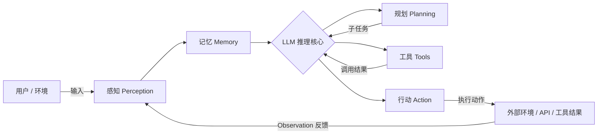
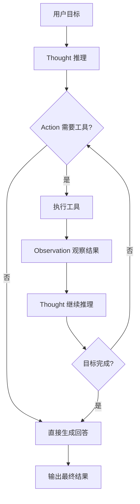

# Agent（AI 智能体）介绍文档 —— 第一部分：概念与架构

> 定位：面向开发者的 Agent 入门介绍文档（第 1–2 章）
> 配套产出：`deliverables/agent_intro_outline.md`（总大纲）、`agent_intro_ch3_ch4.md`（核心功能与使用方式）
> 受众：有基础编程经验、想快速理解并上手 Agent 的开发者

---

## 第一章 概念定义

### 1.1 什么是 Agent（AI 智能体）

**Agent（智能体）** 是一个以大型语言模型（LLM）为"大脑"、能够**感知环境 → 自主规划 → 调用工具/执行动作 → 观察反馈 → 迭代循环**，直至完成用户目标的软件系统。

与传统的"一问一答"式对话机器人（Chatbot）不同，Agent 的核心不是"生成一段文本"，而是"完成一件任务"。它像一位能独立工作的数字员工：理解你的目标，拆解步骤，自己查资料、跑代码、操作工具，遇到问题会调整策略，最后把结果交付给你。

一句话概括：

> **Agent = LLM（推理核心） + 记忆（上下文持久化） + 工具（行动手段） + 环境（反馈回路）**

### 1.2 Agent 的核心特性

| 特性 | 说明 | 反面示例（无此特性） |
|---|---|---|
| **自主性（Autonomy）** | 在目标约束下自行决策，无需每步人工指示 | 每次回答都需要用户引导的 Chatbot |
| **目标导向（Goal-directed）** | 围绕一个明确目标组织行为，而非逐轮问答 | 只回答当前问题、无任务意识的系统 |
| **环境交互（Environment Interaction）** | 能感知环境状态并施加影响，接收结果反馈 | 纯文本生成、无法感知外部世界的模型 |
| **工具使用（Tool Use）** | 调用函数/API/代码解释器等扩展能力边界 | 知识截止、无法联网/执行操作的纯 LLM |
| **规划与反思（Planning & Reflection）** | 将长目标分解为子步骤，并根据失败反馈自我修正 | 一次性输出、不校验结果正确性的直出式生成 |
| **记忆（Memory）** | 跨轮次、跨会话地保留上下文与沉淀经验 | 每次对话都"失忆"、无法学习的历史会话 |

### 1.3 发展历程：从符号智能体到 LLM Agent

| 阶段 | 时间 | 代表形态 | 特点与局限 |
|---|---|---|---|
| **符号主义智能体** | 1950s–1980s | 专家系统（如 MYCIN）、通用问题求解器（GPS） | 基于规则与逻辑推理，可解释但依赖人工编码知识，脆弱、难以扩展 |
| **反应式与 BDI 智能体** | 1980s–1990s | 反应式 Agent（Brooks 行为主义）、BDI（信念-愿望-意图）模型 | 强调环境响应与信念建模，但缺乏深层语言理解与通用知识 |
| **学习型智能体** | 1990s–2010s | 强化学习 Agent（AlphaGo、机器人控制）、多智能体系统（MAS） | 能从交互中学习最优策略，但迁移性与通用性有限 |
| **LLM Agent 兴起** | 2022–2023 | ReAct、Toolformer、AutoGPT、BabyAGI、ChatGPT Plugins/Function Calling | 以 LLM 为推理引擎，具备通用语言理解、规划与工具调用能力 |
| **Agent 工程化与多智能体** | 2023–至今 | LangChain/LangGraph、AutoGen、CrewAI、OpenAI Assistants API、Claude Agent SDK | 框架化、可观测、可生产部署；角色化多智能体协作与自主 Agent 生态爆发 |

**关键里程碑**：2022 年 ReAct 论文提出"推理 + 行动交替"范式；2023 年 OpenAI 发布 Function Calling 与 Plugins，使 LLM 能结构化调用外部工具；2023 下半年起 LangChain、AutoGen、CrewAI 等框架将 Agent 开发"工程化"，推动其从研究原型走向生产应用。

### 1.4 与相关概念的关键术语辨析

| 术语 | 说明 | 与 Agent 的关系 |
|---|---|---|
| **LLM（大语言模型）** | 纯文本生成/推理模型 | Agent 的"推理引擎"，是组件而非 Agent 本身 |
| **Chatbot（对话机器人）** | 以对话为核心交互形态 | 无自主性的对话界面；Agent 可内嵌对话能力但不止于此 |
| **Workflow / Pipeline** | 预定义固定流程，步骤与分支预先写死 | 无自主决策；Agent 是"流程由模型动态生成" |
| **RAG（检索增强生成）** | 检索外部知识库辅助生成 | 可视为 Agent 的"知识型工具"之一 |
| **Tool / Function Calling** | 模型按结构化 schema 调用外部函数/API | Agent 实现"行动"的关键机制之一 |

### 1.5 为什么需要 Agent：LLM 的局限与 Agent 的解法

**纯 LLM 的局限**：
- 知识截止于训练数据，无实时信息；
- 无法访问/操作外部系统（查库、写文件、发请求）；
- 无法自主拆解并执行多步任务；
- 存在幻觉风险，且不校验自身输出。

**Agent 的解法**：
- 接入实时工具（搜索、API、数据库）弥补知识时效；
- 外挂长期记忆沉淀用户画像与经验；
- 分步规划 + 执行验证，降低幻觉影响；
- 产生可解释的行动轨迹，便于审计与复盘。

### 1.6 Agent 的分类（简要）

- **按组织形态**：单智能体（Single-Agent）、多智能体（Multi-Agent，角色分工协作）、人机协同（Human-in-the-loop，关键节点人工确认）。
- **按决策范式**：
  - **ReAct 式**：边推理边行动，Thought → Action → Observation 循环；
  - **Plan-and-Execute 式**：先制定整体计划再逐项执行，适合长任务；
  - **反射式（Reflexion）**：执行后基于失败反馈自我反思，改进下一轮策略。

---

## 第二章 架构组成

### 2.1 总体架构：感知 — 规划 — 记忆 — 工具 — 行动（五要素）

现代 LLM Agent 的架构可归纳为五大核心要素。它们围绕"**模型（LLM）推理核心**"协同工作，构成一个与环境持续交互的闭环：

| 要素 | 职责 | 典型实现 |
|---|---|---|
| **感知（Perception）** | 接收并解析来自用户、环境、工具结果的多模态输入，转换为模型可理解的上下文 | 文本/图像/语音输入解析、环境状态抓取、工具返回结果的结构化整理 |
| **规划（Planning）** | 将目标分解为子任务，编排执行顺序，并在执行中根据反馈重规划 | 任务分解（Task Decomposition）、思维链（CoT）、自我反思（Self-Reflection） |
| **记忆（Memory）** | 保存上下文与历史经验，支持跨轮次、跨会话的一致性 | 短期记忆（上下文窗口）、长期记忆（向量数据库、摘要存储） |
| **工具（Tools）** | 提供行动能力，扩展模型无法直接完成的读写与操作 | 函数调用（Function Calling）、REST API、代码解释器、浏览器/搜索、数据库 |
| **行动（Action）** | 将决策落地为具体动作并与环境交互，获取结果反馈形成闭环 | 工具执行、消息发送、文件写入、界面操作、结果输出 |

### 2.2 各要素详解

#### ① 感知（Perception）—— Agent 的"眼睛和耳朵"
感知层负责把外部世界的状态翻译给模型。它既包括用户输入（自然语言、图片、语音），也包括工具/环境的反馈（API 返回值、报错信息、网页内容、代码执行输出）。高质量的感知需要对输入做**清洗、结构化与截断摘要**，防止上下文被无关信息淹没，同时保留关键事实。

#### ② 规划（Planning）—— Agent 的"决策中枢"
- **任务分解（Task Decomposition）**：把复杂目标拆成有依赖关系的子任务（顺序或 DAG 编排）；
- **思维链（Chain-of-Thought）**：显式要求模型"先想后做"，逐步推理以提高正确率；
- **自我反思（Self-Reflection）**：执行后评估结果，识别错误并制定修正策略（Reflexion 的核心）；
- **重规划（Re-planning）**：当某一步失败或环境变化时，动态调整剩余计划而非死板执行。

#### ③ 记忆（Memory）—— Agent 的"长期与短期记忆"
- **短期记忆**：当前会话的上下文窗口，承载本轮目标、中间推理与工具结果；
- **长期记忆**：跨会话持久化。常用向量数据库（Chroma、Pinecone、Milvus）做语义检索，也可用数据库/文件保存用户画像、业务知识与历史经验；
- **记忆管理策略**：上下文超限时做摘要压缩、滑动窗口裁剪、关键信息抽提，控制成本与延迟。

#### ④ 工具（Tools）—— Agent 的"手脚"
工具是 Agent 突破模型能力边界的关键：搜索、代码执行、数据库查询、文件读写、第三方 API、浏览器操作等。模型通过**函数调用（Function Calling）** 按声明的 schema 输出"调用哪个工具、传什么参数"，由运行时执行后把结果回填为 Observation。工具描述的质量直接决定调用准确率。

#### ⑤ 行动（Action）—— Agent 的"闭环引擎"
行动层将规划结果与工具调用真正落地：执行动作、捕获结果/异常、决定继续推理还是终止。它与感知层共同构成"行动 → 反馈 → 再行动"的闭环，是 Agent 区别于静态生成系统的本质。

### 2.3 参考架构模式

- **ReAct（Reasoning + Acting）**：Thought（推理）→ Action（行动）→ Observation（观察）交替循环，是当前最主流的范式，兼顾推理质量与可解释性。
- **Plan-and-Execute / Plan-and-Solve**：先用 LLM 制定完整计划，再逐项执行（可配合执行器），适合长周期、多步骤任务，减少每步的推理开销。
- **Reflexion**：引入"评估者"角色，执行失败后产生反思文本（语言化的强化信号）指导下一轮，显著提升复杂任务成功率。
- **Multi-Agent 协作架构**：角色化分工（如 Planner / Executor / Critic），通过消息传递协作，代表有 AutoGen、CrewAI、LangGraph 的多智能体编排。

### 2.4 数据流与典型调用时序

```
用户输入目标
   │
   ▼
① 感知：解析输入 → 写入短期记忆
   │
   ▼
② 规划：LLM 将目标拆分为子任务列表（含依赖）
   │
   ▼
③ 对每个子任务循环：
    ├─ 检索长期记忆（如有需要）
    ├─ LLM 决策：直接回答 或 调用工具
    ├─ 执行工具 → 获取 Observation（结果/报错）
    └─ 结果回填上下文 → 继续推理（或重规划）
   │
   ▼
④ 全部子任务完成 → 汇总输出
   │
   ▼
⑤ （可选）将关键结论/经验写入长期记忆
```

### 2.5 架构图示

**图 1：Agent 五要素关系图（模型居中）**



**图 2：ReAct 循环流程图**



> 说明：上图为 Mermaid 源码，渲染时可直接嵌入 Markdown 支持的环境（GitHub、Typora 等）；如目标平台不支持 Mermaid，可替换为静态架构图（详见附录图示建议）。

---

## 本章小结

- **概念上**：Agent 是"以 LLM 为大脑、能感知环境、自主规划、调用工具并闭环行动"的目标驱动系统，其核心价值在于**自主性、目标导向、环境交互与工具使用**。
- **历史上**：Agent 经历了符号主义 → 反应式/BDI → 学习型 → LLM Agent 四个阶段，2022 年以来因 LLM 与函数调用能力而进入工程化爆发期。
- **架构上**：**感知 — 规划 — 记忆 — 工具 — 行动** 五要素围绕 LLM 推理核心构成闭环；ReAct、Plan-and-Execute、Reflexion、Multi-Agent 是四种主流架构范式，可用于指导实际系统设计。

下一部分（第三章 核心功能、第四章 使用方式）将在此基础上展开 Agent 的能力清单与工程落地方法。
