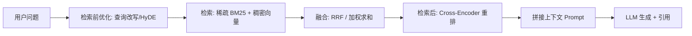
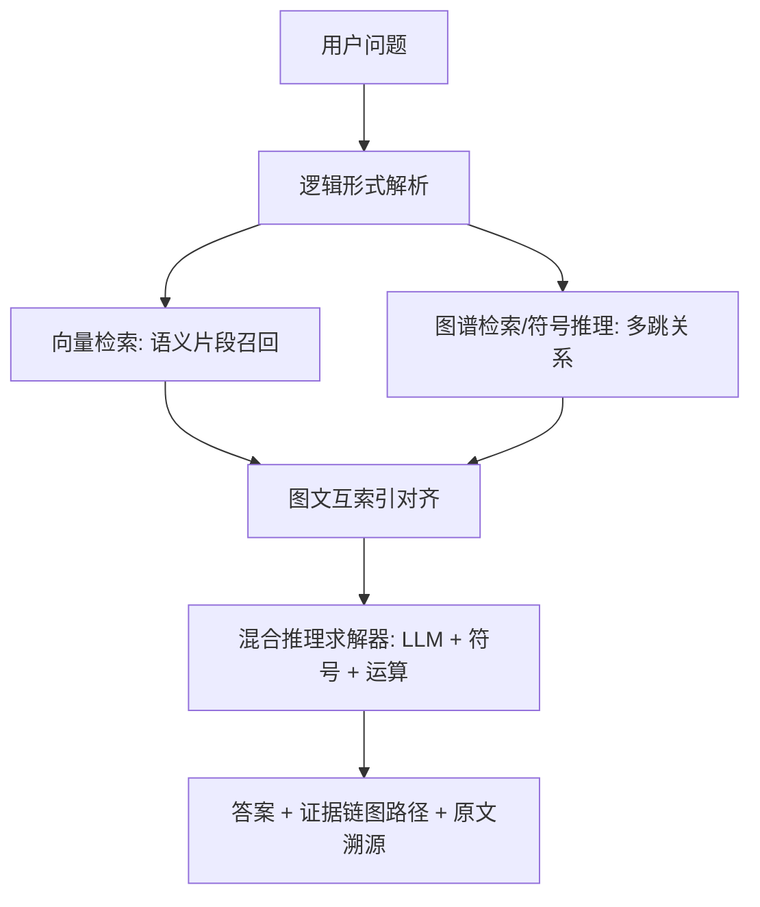
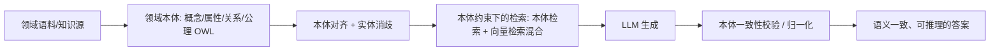
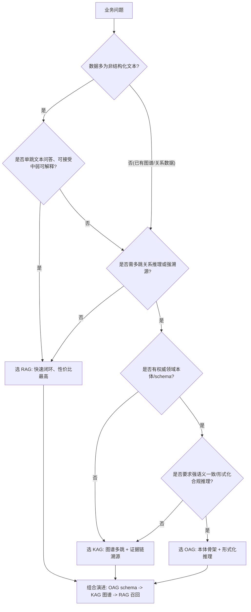

# RAG / KAG / OAG 三大知识增强范式：对比分析与技术选型报告

> **知识分享会主报告**。面向工程团队与业务方，系统梳理 RAG、KAG、OAG 三大知识增强/知识图谱技术范式，给出原理、架构、代表实现、适用边界、横向对比、落地场景与选型建议。
>
> **口径声明**：本报告内容与 `deliverables/research-notes.md` 保持一致。RAG、KAG 有明确、可核验的提出方与论文；**OAG 缩写存在歧义**（详见 §2.3 与脚注），本文取 *Ontology-Augmented Generation（本体增强生成）* 之义，**它并非学界公认的标准缩写**。凡未联网核验的条目，本文均已显式标注，不含编造的量化数据或来源。

---

## 一、引言：为什么知识增强成为 LLM 落地的关键

大语言模型（LLM）具备强大的通用语言与推理能力，但在企业真实落地中，普遍会撞上四堵"知识墙"：

1. **幻觉（Hallucination）**：当模型缺乏依据时，倾向于生成"看起来合理、实则错误"的内容。在金融、医疗、政务等强合规领域，一次幻觉就可能带来事故级后果。
2. **时效性（Freshness）**：模型参数的知识有训练截止时间，无法反映最新政策、最新产品、最新行情；而重训/微调成本极高、周期极长。
3. **领域知识缺失（Domain Knowledge Gap）**：企业内部文档、业务规则、专有数据、专家经验，从未进入模型参数，模型"天然不知道你的生意"。
4. **可解释性（Explainability）**：纯参数化生成是"黑盒"，答案无法追溯到依据；而合规审计、责任界定、专家复核都要求"言之有据、有据可查"。

**知识增强（Knowledge Augmentation）的核心思路**，是在**不重新训练模型**的前提下，把外部知识接入生成过程——让模型"开卷考试"。围绕"知识以何种形态被组织、检索与推理"，业界逐步形成了三种代表性范式，可概括为一句话：

| 范式 | 一句话定位 | 解决的核心矛盾 |
|---|---|---|
| **RAG** | 检索增强生成 | **找得到** —— 把外部非结构化知识快速接进来 |
| **KAG** | 知识增强生成 | **理得清** —— 把关系理成图谱，能多跳、能溯源 |
| **OAG** | 本体增强生成 | **想得通** —— 用本体定义规则，语义一致、可推理、可复用 |

三者并非互斥替代，而是**知识载体从"非结构化文本块 → 图文互索引的混合知识图谱 → 本体/模式约束"逐层演进**，可组合、可递进地使用（详见 §3、§5）。

---

## 二、三大范式逐一详解

### 2.1 RAG —— 检索增强生成（Retrieval-Augmented Generation）

#### 原理

RAG 把"参数化记忆"（模型权重中的知识）与"非参数化记忆"（外部文档库）结合：给定问题，先用**检索器**从外部语料召回相关文档，再把这些文档作为上下文交给**生成模型**作答。其目的是让模型在不重训参数的情况下，获得最新、可溯源、领域专有的知识，从而降低幻觉、提升事实性并支持引用。

> **代表论文（高置信）**：Patrick Lewis 等，*Retrieval-Augmented Generation for Knowledge-Intensive NLP Tasks*，Facebook AI Research，NeurIPS 2020（arXiv:2005.11401）。它把预训练生成器（BART）与稠密检索器（DPR）以"隐变量"方式联合，含 RAG-Sequence 与 RAG-Token 两种边缘化方式。前序工作还包括 DPR（arXiv:2004.04906）、REALM（arXiv:2002.08909）、ORQA（arXiv:1906.00300）。

#### 架构流程（Naive → Advanced → Modular）

RAG 的演进三阶段（术语出自 Yunfan Gao 等综述 *Retrieval-Augmented Generation for Large Language Models: A Survey*，arXiv:2312.10997）如下：

| 阶段 | 核心变化 | 关键手段 |
|---|---|---|
| **Naive RAG** | "检索—生成"两段式，直接索引切块 | 文本切块 → 向量化 → 向量库 Top-K 检索 → 拼接 Prompt → 生成 |
| **Advanced RAG** | 在检索前后加优化环节 | 检索前：查询改写/扩展、HyDE；检索中：混合检索；检索后：Rerank 重排 |
| **Modular RAG** | 把 RAG 拆成可复用/可重组的"乐高模块" | 引入 Routing、Memory、Search、Predict、Fusion 等独立模块与流程编排 |

#### 代表实现

- **检索技术**：稀疏检索 BM25；稠密检索 DPR、BGE、E5、text-embedding-3；混合检索融合算法 RRF。
- **向量库**：FAISS、Milvus、Qdrant、Weaviate、Pinecone、pgvector。
- **重排（Post-retrieval）**：Cross-Encoder（bge-reranker、Cohere Rerank）、迟交互 ColBERT（Khattab & Zaharia，2020，arXiv:2004.12832）、LLM 重排（RankGPT）。
- **进阶范式**：Self-RAG（arXiv:2310.11511）、Corrective RAG / CRAG（arXiv:2401.15884）、GraphRAG（微软，Edge 等，2024，arXiv:2404.16130，编号待复核）。
- **工程框架**：LangChain、LlamaIndex、Haystack。

#### 适用边界

- **适合**：非结构化文本的**单跳**问答、语义搜索、制度/文档助手；知识更新频繁、需要快速上线、团队资源有限的场景。
- **不适合/需谨慎**：① 检索质量即性能天花板，"垃圾进、垃圾出"；② 切块策略敏感，易丢跨块上下文；③ **弱多跳/逻辑推理**，难以做跨文档聚合推理；④ 模型可能"忽视检索内容"仍按参数作答；⑤ 上下文窗口与延迟/成本压力；⑥ 对强结构化、需一致性的专业领域（政务、医疗）支撑不足。
  - → 这正是 KAG / OAG 试图解决的问题。

---

### 2.2 KAG —— 知识增强生成（Knowledge Augmented Generation）

#### 原理

KAG 是**蚂蚁集团（Ant Group）**提出的"知识增强生成"框架，建立在其开源知识图谱引擎 **OpenSPG** 之上，目标是在**专业领域**（政务、医疗等）增强大模型生成的事实性、逻辑一致性与可解释性。可视为对纯向量 RAG 的"知识图谱化升级"。

> **代表论文/项目（高置信）**：*KAG: Boosting LLMs in Professional Domains via Knowledge Augmented Generation*，Liangcai Su 等，蚂蚁集团，arXiv:2409.13731（2024-09）。开源：OpenSPG/KAG（github.com/OpenSPG/KAG）；底座 OpenSPG（github.com/OpenSPG/openspg）。（仓库路径/star 数未联网核验，引用时以实际访问为准。）

#### 架构流程

KAG 论文提出的关键设计（术语以原文为准）：

1. **LLM 友好的知识表示（LLMFriSPG）**：兼容"模式约束（schema-constrained/结构化）"与"无模式（schema-free/非结构化文本）"的统一知识表示，让图谱既能表达严格本体，又能容纳自由文本。
2. **图结构与文本块互索引**：图谱节点与原始文本 chunk 建立**双向索引**，实现"图谱可回溯原文、原文可定位图谱"。
3. **逻辑形式引导的混合推理求解器**：把自然语言问题转成"逻辑形式"，再由求解器编排 **LLM 推理 + 符号化图谱推理 + 数学/逻辑运算**，弥补纯向量检索的弱逻辑缺陷。
4. **语义推理驱动的知识对齐**：用语义推理完成概念/实体对齐，减少知识冲突与冗余。
5. **KAG-Model**：面向自然语言理解（NLU）的模型组件，参与理解与推理。

检索方式上，KAG 采用**混合检索**：向量检索负责从海量文本召回语义片段；图谱检索/符号推理负责结构化、可验证的多跳关系推理；二者通过互索引协同。相较纯向量 RAG，KAG 更强调"逻辑形式 + 图谱"来保证多跳与专业一致性。

#### 代表实现

- **框架/底座**：OpenSPG/KAG + OpenSPG 语义增强知识图谱引擎（蚂蚁集团开源）。
- **可类比/相邻方向**：微软 GraphRAG（图增强检索，arXiv:2404.16130，待复核）；以及各类"GraphRAG / KG-RAG"社区实现。

#### 适用边界

- **适合**：需要**多跳关系推理、证据链溯源、专业知识一致性**的场景；政务/医疗/金融等强合规、强可解释领域。论文报告在 HotpotQA、2WikiMultiHopQA 等任务上有提升（具体数值以论文为准）。
- **不适合/需谨慎**：① 需构建并维护知识图谱/本体，**前期成本高**；② 依赖领域 schema 设计，迁移性受限；③ 工程链复杂（图谱 + 向量 + 推理求解器），落地门槛高于朴素 RAG；④ 强依赖高质量领域数据。若业务大多是单跳文本问答，改造收益有限。

---

### 2.3 OAG —— 本体增强生成（Ontology-Augmented Generation）

> ⚠️ **重要不确定性声明**：与前两者不同，**"OAG"在知识增强/知识图谱文献中并非公认的标准化简称**，不像 RAG（2020, NeurIPS）和 KAG（2024, arXiv:2409.13731）那样有明确的"提出方 + 论文 + 开源"。本节内容为**概念性/方向性描述，非权威出处**，对外引用务必标注"非标准缩写、待核验"。此外需注意跨领域同名缩写干扰，如 OAG（Official Airline Guide，航空航班数据服务商）、OAG（Office of the Attorney General）等。

#### 原理

OAG 的核心思想是：在检索与生成之间引入**本体（Ontology）/概念模式（schema）**作为"知识骨架"，用本体来**组织语料、约束检索范围、校验/归一化生成内容**，从而获得比纯文本单元检索更强的语义一致性、可解释性与推理能力。它可视为"本体/模式驱动的知识增强生成"这一方向的统称，与 KAG 方向高度相邻——区别在于 KAG 由蚂蚁集团明确提出并配套 OpenSPG 开源实现，而 OAG 更多是学术/社区里的概念性说法，缺乏单一权威出处。

社区中与"本体驱动 RAG"相关的候选名有 *Ontology-Grounded Retrieval-Augmented Generation*（疑似缩写 OG-RAG）、"Ontology-driven RAG / OntoRAG"等，但**作者、机构、年份、arXiv 号均未核验，故本文不填写具体编号**。

#### 架构流程（概念层）

关键组件（概念层）：领域本体/OWL 模式；本体对齐与实体消歧；本体约束下的检索（本体检索 + 向量检索混合）；生成后的本体一致性校验。

#### 代表实现

- **无主流统一实现**（待核验）。能力上可由**本体/知识图谱工具链**部分承载：RDF/OWL 建模与推理（如 Protege、Apache Jena、RDFLib 等语义网工具），再与 RAG/KAG 框架拼接使用。
- 与 **KAG/OpenSPG** 存在方向重叠：KAG 的"模式约束 + 无模式统一表示（LLMFriSPG）"本身已带有本体/模式驱动色彩，可视为 OAG 理念的一种工程化落地参考。

#### 适用边界

- **适合**：**强语义一致性、形式化合规推理、跨系统/跨团队知识复用**的强规范领域（医疗、金融、制造、政务）。
- **不适合/需谨慎**：① 本体构建与维护成本**极高**；② 本体覆盖率与更新滞后问题；③ 对本体质量强依赖，建模门槛高、依赖领域专家、落地周期长；④ **缺少成熟统一实现与评测基准**；⑤ 对生成的增强是**间接的**（通过约束与推理间接作用于答案）。

---

## 三、横向对比分析

下表从 8 个维度横向对比三大范式（≥6 维，覆盖知识表示形式、检索/推理机制、构建成本、可解释性、更新维护成本、幻觉控制能力、对结构化数据的依赖度、典型开源项目）：

| 维度 | RAG | KAG | OAG |
|---|---|---|---|
| **知识表示形式** | 非结构化文本块（chunk）+ 向量 | 结构化知识图谱（实体—关系）+ 文本块互索引 + 向量 | 本体/概念模式（概念、属性、约束、公理，OWL 风格） |
| **检索/推理机制** | 相似度检索（稀疏 + 稠密 + Rerank） | 图结构与文本块混合检索 + 逻辑形式引导的符号/图谱推理 | 基于本体的形式化/一致性推理 + 本体约束检索 |
| **构建成本** | 低（切块 + 向量化即可） | 中—高（需建图 + 领域 schema + 治理） | 高（需领域专家建模本体，周期长） |
| **可解释性** | 弱—中（靠引用片段溯源） | 强（图路径 + 证据链，可回溯原文） | 强（规则/公理可追溯、可形式化验证） |
| **更新维护成本** | 低（增删文档、重建索引即可） | 中—高（图谱需持续抽取、对齐、消歧治理） | 高（本体变更牵一发动全身，需版本化与专家评审） |
| **幻觉控制能力** | 中（依赖检索质量，检索不到易答偏） | 强（结构化证据 + 逻辑校验） | 强（本体一致性校验，形式化约束） |
| **对结构化数据的依赖度** | 低（主要吃非结构化文本） | 高（强依赖结构化图谱/关系数据） | 极高（强依赖本体/schema 这一结构化知识层） |
| **典型开源项目** | LangChain、LlamaIndex、Haystack、FAISS、Milvus、Qdrant | OpenSPG/KAG、OpenSPG；相邻：微软 GraphRAG | 无主流统一实现；能力可由 Protege/Jena/RDFLib 等语义网工具 + 上述框架拼接 ⚠️ |

> **表格口径说明**：RAG/KAG 的代表项目有明确出处；OAG 一行标注"无主流统一实现"并给出可替代的工具链拼装方式，避免杜撰项目名。可解释性、幻觉控制等为**定性工程判断**，非实测指标。

**关系与演进**：三者是**逐层增强**而非互斥替代——知识载体沿"非结构化文本块（RAG）→ 图文互索引的混合知识图谱（KAG）→ 本体/模式约束（OAG）"演进；推理能力沿"向量相似（RAG）→ 逻辑形式 + 符号推理（KAG）→ 本体一致性推理（OAG）"演进。三者可组合使用（见 §5）。

---

## 四、应用场景：每个范式的落地画像

### 4.1 RAG 的适用场景

| 场景 | 为什么要用 RAG（适配理由） |
|---|---|
| **客服/售后知识库问答** | 问题多为**单跳事实查询**（"退货政策""保修期多久"），知识以非结构化文档/FAQ 形式存在且更新频繁；RAG 无需重训即可热更新，改造量最小、上线最快。 |
| **企业内部文档 / 制度与流程问答** | 制度、SOP、规章制度数量大、术语杂，且强调"答案要给原文出处"；RAG 的检索 + 引用天然满足"可溯源"，向量库生态成熟。 |
| **政务/产品语义检索** | 用户查询口语化、与文档措辞不一致，稠密向量 + 混合检索 + 重排能显著提升召回；单跳检索即可满足，性价比最高。 |

### 4.2 KAG 的适用场景

| 场景 | 为什么要用 KAG（适配理由） |
|---|---|
| **金融风控 / 投研关系推理** | 问题常是"某公司→股东→关联方→风险事件"这类**多跳关系**，且监管要求答案可解释、可追溯；KAG 的图谱多跳 + 互索引证据链正好命中"关系 + 溯源"双重刚需。 |
| **企业知识中台 / 关系型知识问答** | 企业内实体（人、部门、项目、产品、客户）关系密集，纯文本检索难以跨实体聚合；KAG 以图谱承载关系、向量召回文本，兼顾结构化推理与语义召回。 |
| **医疗辅助诊断（结构化知识部分）** | 疾病—症状—药物—检查的**关系网络**强结构化，误诊代价高、需可解释；图谱多跳推理 + 逻辑校验可提供证据链，支撑医生复核。 |

### 4.3 OAG 的适用场景

| 场景 | 为什么要用 OAG（适配理由） |
|---|---|
| **医疗/生物信息的规范化知识底座** | 医学本体（如概念层次、关系约束）是行业共识级"语义标准"，跨医院/系统需**强语义一致性**；本体做骨架可复用、可推理、可校验，长期价值高。 |
| **工业设备运维 / 制造知识管理** | 设备—部件—故障—工单—手册需严格语义对齐，跨工厂、跨设备型号复用要求高；本体约束保证"同一概念在多系统里指同一个东西"，避免语义漂移。 |
| **监管合规 / 政务规则的合规推理** | 法规、条款、资格条件本身高度形式化，需**形式化推理与一致性校验**（"是否满足某合规条件"）；本体/规则层可做可追溯的合规判定，是重投入但有长期资产的场景。 |

> **组合场景示例**：**企业知识中台**可三层组合——**OAG 提供统一 schema 与规则 → KAG 承载图谱与多跳检索 → RAG 负责快速向量召回**，各取所长。

---

## 五、技术选型建议

### 5.1 选型原则

**由问题驱动，先跑通、再增强。** 不要为技术而技术，也不必一步到位；用业务问题的复杂度与合规要求，倒推该用哪一层。

### 5.2 判断清单（Checklist）

| 判断项 | 若"否/低" | 若"是/高" |
|---|---|---|
| **① 数据是否已成图谱/关系数据？** | 数据多为非结构化文本 → 从 **RAG** 起步 | 已有实体—关系数据 → 可考虑 **KAG** |
| **② 领域本体/schema 是否存在？** | 无现成本体 → 先用轻量 schema，不必强上 **OAG** | 已有权威本体 → **OAG** 性价比显著提升 |
| **③ 团队工程能力？** | 人手有限、无图谱/语义网经验 → **RAG** | 具备图谱/推理工程能力 → 可上 **KAG/OAG** |
| **④ 成本预算？** | 预算紧、要快速见效 → **RAG** | 有长期知识资产投入意愿 → **KAG/OAG** |
| **⑤ 时延要求？** | 要求毫秒级低延迟在线问答 → **RAG**（无重推理） | 可接受多跳/推理带来的更高时延 → **KAG/OAG** |
| **⑥ 是否需要多跳关系推理？** | 单跳文本问答即可 → **RAG** | 需跨实体多跳 → **KAG** |
| **⑦ 是否要求答案可解释/可溯源？** | 弱要求 → **RAG** | 强合规/审计要求 → **KAG/OAG** |
| **⑧ 是否需强语义一致/形式化合规推理？** | 否 → **RAG/KAG** | 是 → **OAG** |

### 5.3 决策树

### 5.4 组合使用建议（推荐路线）

- **推荐组合**：**OAG 提供统一 schema 与规则 → KAG 承载图谱与多跳检索 → RAG 负责快速向量召回**，各取所长。
- **落地分步走**：① 先把 **RAG** 跑通，形成可用闭环；② 当出现**多跳/可解释诉求**时，引入 **KAG**（若当前多为单跳问答，改造收益有限，不必强上）；③ 当需要**强语义一致与合规推理**时，再补 **OAG**；领域语义复杂时建议**先有本体再做图谱**，避免图谱建成后语义不统一。
- **验证方式**：围绕业务指标（答案准确率、人工兜底率、复杂问题覆盖度、可解释/溯源是否满足合规）在小范围场景做对照验证，用真实业务问题集检验后再决定是否扩大投入，不做无依据的规模扩张。

---

## 六、总结与展望

### 6.1 三句话记住三者

1. **RAG 解决"找得到"**：快速把外部知识接进来，工程最成熟、上手最快。
2. **KAG 解决"理得清"**：把关系理成图谱，能多跳、能溯源。
3. **OAG 解决"想得通"**：用本体定义规则，语义一致、可推理、可复用。

### 6.2 选型一句话

**由问题驱动，先跑通、再增强**：简单文档问答/资源有限 → RAG；关系型/多跳/需可溯源的强合规场景 → KAG；强语义一致/形式化合规推理 → OAG。三者可组合、可演进，由业务问题的复杂度与团队投入能力共同决定选用层级。

### 6.3 展望

- **融合趋势**：RAG 的"快速召回"与 KAG/OAG 的"结构化推理/语义约束"正在融合（如 GraphRAG、图谱—向量混合检索），"图谱/本体 + 向量"将成为专业领域落地的默认组合。
- **成本下降**：随着大模型自动抽取实体关系与辅助本体建模能力提升，图谱与本体构建的人力门槛有望降低，KAG/OAG 的落地性价比将进一步上升。
- **标准与评测待补齐**：KAG 已有论文与开源实现；**OAG 目前仍缺乏权威单一起源与统一评测基准**，其标准化程度是未来值得关注的方向。
- **务实建议**：对多数团队而言，优先把 RAG 闭环跑通并量化收益，再按真实业务痛点（多跳、可解释、合规）逐层引入 KAG/OAG，是风险最低、回报最稳的路径。

---

> **配套材料**：分享会一页纸速览、PPT 大纲与 Q&A 见 `deliverables/rag-kag-oag-sharing-pack.md`；原始调研与出处清单见 `deliverables/research-notes.md`。本报告结论与两份材料保持一致。
>
> **脚注**：OAG 缩写存在歧义，本文取 *Ontology-Augmented Generation（本体增强生成）* 之义，**非公认标准缩写**；其权威出处、KAG 仓库路径及 GraphRAG 论文编号等，建议在可联网时按 `research-notes.md` §5 复核。
